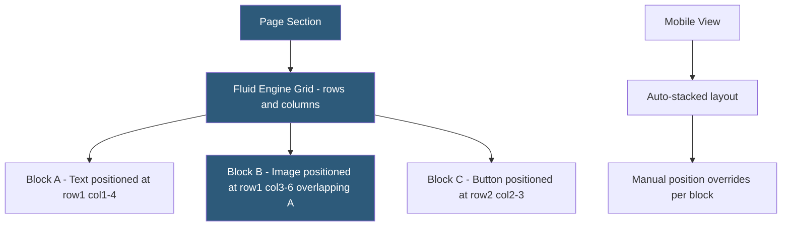

**Category:** Website Builder Platforms
**Difficulty:** Intermediate
**Reading time:** 5 min read

---

Squarespace Fluid Engine is the drag-and-drop layout system introduced in Squarespace 7.1, replacing the older section-and-block stacking model with a free-form grid that allows precise content positioning. It enables overlapping elements, custom spacing, and complex visual compositions previously impossible in standard Squarespace. Fluid Engine closes the gap between Squarespace's template-based approach and the free-positioning editors offered by Wix and Webflow.

- **Fluid Engine** — Squarespace's grid-based layout system allowing free element positioning within sections
- **grid** — underlying structure of invisible rows and columns that blocks snap to in Fluid Engine
- **block positioning** — ability to place any block (text, image, button) at any grid position within a section
- **overlap** — Fluid Engine capability to stack blocks on top of each other for layered visual compositions
- **section** — page division containing a Fluid Engine grid; each section has its own grid
- **responsive behavior** — Fluid Engine sections automatically adapt positions for mobile breakpoints with manual override capability
- **block resize handles** — corner and edge handles for adjusting block dimensions on the grid
- **desktop vs mobile editor** — separate editing views for desktop and mobile layouts in Fluid Engine sections

Fluid Engine sections contain an invisible grid with configurable column and row dimensions. Blocks are placed by clicking the add button, which inserts a new block into an empty grid area. Once placed, blocks can be repositioned by dragging to different grid cells, and resized by dragging resize handles to span multiple columns or rows. The grid snapping ensures consistent alignment without pixel-perfect fussiness.

The key differentiator from the previous Squarespace layout system is block overlap. By positioning two blocks to occupy the same or overlapping grid areas, designers can layer text over images, create diagonal cut-out effects, or build visually complex hero sections. Z-index stacking order is controlled through the block arrangement panel (bring to front, send to back).

Responsive behavior handles the transition to mobile automatically, stacking blocks in the order they appear in the grid. For layouts where automatic stacking produces poor results, the mobile editor (accessible via the mobile toggle in the editor toolbar) allows independent positioning adjustments for mobile without affecting the desktop layout.

Section-level padding, margin, and background settings (color, image, video, gradient) are configured in the section's Design panel. Sections can have full-width or contained-width content areas, and section height can be set to fixed pixel values, viewport height, or auto (fitting to content).

Fluid Engine sections coexist with the older stacked block sections in Squarespace 7.1 sites. New sections default to Fluid Engine; existing sites upgraded from the pre-Fluid Engine layout retain their old sections and can convert them to Fluid Engine individually.

- Creating hero sections with overlapping text and photography for impactful first impressions
- Building feature comparison grids with images and text side-by-side at custom proportions
- Designing editorial layouts with pull quotes overlapping article text
- Creating asymmetric portfolio grids with images of varying sizes and positions
- Layering logo images over header background photos for branded headers

| Advantage | Disadvantage |
|-----------|--------------|
| Free positioning eliminates the stacked-block constraint | More complex than simple stacked layouts for basic pages |
| Block overlap enables layered visual compositions | Mobile auto-stacking may require manual mobile layout adjustments |
| Grid snapping ensures alignment consistency | Section-by-section grid is separate; elements cannot span sections |
| Compatible with all Squarespace 7.1 block types | Advanced designs require understanding grid column/row spans |

- [Squarespace Website Builder](squarespace-website-builder.md)
- [Squarespace Templates Library](squarespace-templates-library.md)
- [Webflow Visual Development](webflow-visual-development.md)

---
*Part of the [Website Builder Platforms](index.md) category · [Back to Master Index](../../index.md)*
