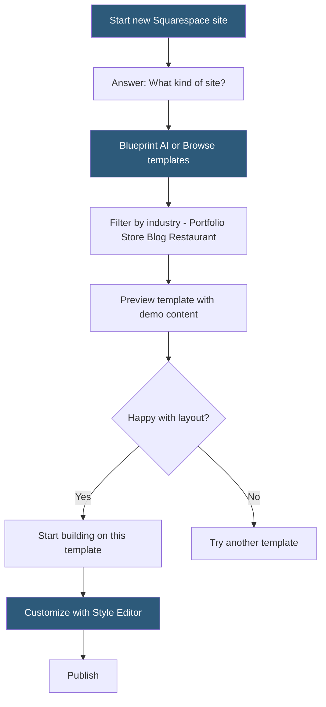

**Category:** Website Builder Platforms
**Difficulty:** Beginner
**Reading time:** 5 min read

---

Squarespace's templates library provides professionally designed website starting points organized by industry and design aesthetic. Unlike competitors where templates vary significantly in quality, Squarespace curates all templates to meet a high visual standard. Templates can be switched after launch, and since Squarespace 7.1 introduced a unified design system, all templates share the same Style Editor and block system, reducing switching friction.

- **template** — pre-designed page layout and style configuration used as a starting point for a new site
- **template family** — Squarespace 7.0 grouping of templates sharing a common underlying codebase
- **Squarespace 7.1** — platform version introducing a unified template system where all templates share the same editing capabilities
- **demo content** — placeholder text and images in templates illustrating layout possibilities
- **template preview** — live browsable demo of a template before committing to it
- **template switching** — changing a site's template after publishing, available in Squarespace 7.1
- **industry category** — template organization by use case: Portfolio, Online Store, Blog, Restaurant, Services
- **Blueprint AI** — Squarespace's AI-assisted design system that recommends and customizes templates based on site goals

Squarespace's template library is accessed during new site creation. After Blueprint AI's setup interview (or by choosing to browse manually), users see templates grouped by use case. Each template card shows a thumbnail with a preview button that opens a full interactive demo on a separate URL, browsable with mock content representing the target use case.

In Squarespace 7.1 (the current platform version), all templates are built on a shared system — the underlying HTML/CSS structure, the block types available, the Style Editor options, and the Commerce features are identical across all templates. The template determines only the default visual settings (font combinations, color palettes, header style, section spacing defaults) and the demo page structure. This means any template can be styled to look like any other given sufficient Style Editor work.

Template switching in 7.1 carries all existing content forward. Section types and block types are universal, so switching templates does not delete content. The visual styling resets to the new template's defaults, requiring the Style Editor to be re-configured. In practice, templates serve primarily as curated starting points for visual style and initial page structures.

Squarespace continually adds templates and retires older ones. Template families from Squarespace 7.0 (pre-2020) have different codebases with different Style Editor options and cannot access some 7.1 features. Sites on 7.0 templates can migrate to a 7.1 template with content remapping assistance.

Blueprint AI refines template selection by generating custom color palettes, font combinations, and suggested page structures based on the user's stated business type and visual style preferences.

- Choosing a portfolio template for a photography business launching a new website
- Selecting a restaurant template with built-in menu section and reservation block layout
- Using a minimal blog template as a starting point for a personal writing site
- Switching from an older template to a 7.1 template to access newer features
- Previewing multiple templates in different industries before settling on a visual direction

| Advantage | Disadvantage |
|-----------|--------------|
| Consistently high-quality design across all templates | Templates optimized for aesthetics may sacrifice content density |
| Template switching preserves content in Squarespace 7.1 | 7.0 template sites cannot access 7.1 features without migration |
| Blueprint AI guides selection for less design-confident users | Smaller total template count than Wix or WordPress theme libraries |
| All templates support same block types and Style Editor | Template-specific starting styles require Style Editor work to override |

- [Squarespace Website Builder](squarespace-website-builder.md)
- [Squarespace Fluid Engine](squarespace-fluid-engine.md)
- [Squarespace Extensions Marketplace](squarespace-extensions-marketplace.md)

---
*Part of the [Website Builder Platforms](index.md) category · [Back to Master Index](../../index.md)*
