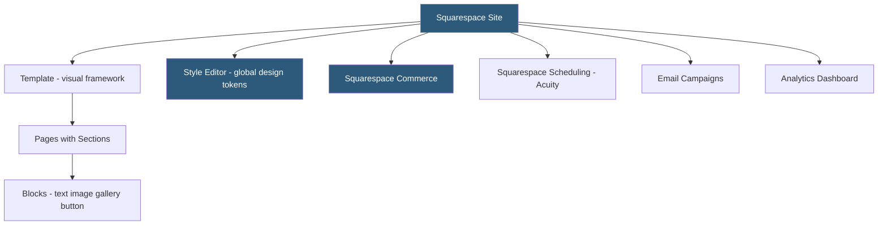

**Category:** Website Builder Platforms
**Difficulty:** Beginner
**Reading time:** 5 min read

---

Squarespace is a premium all-in-one website builder known for award-winning templates, polished typography, and integrated commerce and marketing tools. Targeting designers, creatives, and small businesses, Squarespace emphasizes visual quality and cohesive branding over customization flexibility. It includes built-in tools for blogging, e-commerce, portfolio, scheduling, and email marketing within a single subscription.

- **Squarespace template** — professionally designed starting point defining the site's visual structure and style
- **section** — modular page block combining layout and content that can be added, reordered, and customized
- **block** — smallest Squarespace content unit (text, image, gallery, button, embed) placed within sections
- **Fluid Engine** — Squarespace's drag-and-drop layout system allowing free positioning within sections
- **Style Editor** — panel for adjusting global fonts, colors, spacing, and button styles
- **Squarespace Commerce** — built-in e-commerce including product catalog, checkout, orders, and inventory management
- **Squarespace Scheduling** — Acuity Scheduling-based appointment booking integrated into the site
- **Blueprint AI** — Squarespace's AI-assisted site setup that generates a starting point from style and content preferences

Squarespace operates as a fully managed SaaS platform — no hosting, server management, or software updates required. Users choose a template from Squarespace's curated library, organized by industry and design style. Unlike some builders, Squarespace templates can be changed after launch, though content must be remapped to the new template's sections.

The editor presents pages with their current content. Clicking any element selects it for editing; clicking between elements reveals insertion points for new blocks. Sections — the structural units of a page — can be added from a library of layouts covering every common page structure (hero, features grid, testimonials, contact). Within sections, Squarespace's Fluid Engine allows blocks to be repositioned freely within the section's grid, giving designers precise control over element placement and spacing.

The Style Editor applies global design changes: font family and size for headings and body text, primary and secondary colors, button styles, and spacing scales. These changes propagate across all pages simultaneously, maintaining design consistency. Custom CSS can be added for fine-grained overrides.

Squarespace Commerce enables physical and digital product sales with no third-party integration required. Products are created in the Commerce dashboard; a shop page displays them. Checkout uses Squarespace's own payment processing (Stripe and PayPal). Inventory, orders, shipping rates, and tax rules are all managed within Squarespace.

The Scheduling feature (Acuity Scheduling) handles appointment booking with staff, services, availability windows, and payment collection at booking. It embeds as a booking page within the main site.

- Portfolio sites for photographers, architects, and designers requiring high-quality image presentation
- Restaurant websites with menus, reservation links, and event announcements
- Small retail businesses selling products online with minimal setup complexity
- Service providers needing integrated appointment booking on their website
- Bloggers and journalists who value typography quality and built-in analytics

| Advantage | Disadvantage |
|-----------|--------------|
| Highest-quality templates in the website builder market | Less customization flexibility than Webflow or WordPress builders |
| Commerce, scheduling, and email all in one platform | Monthly cost higher than basic alternatives for all-in-one features |
| Template switching after launch is supported | Extension ecosystem smaller than WordPress or Wix |
| No hosting or server management required | Less control over technical SEO than self-hosted platforms |

- [Squarespace Templates Library](squarespace-templates-library.md)
- [Squarespace Fluid Engine](squarespace-fluid-engine.md)
- [Wix Website Builder](wix-website-builder.md)

---
*Part of the [Website Builder Platforms](index.md) category · [Back to Master Index](../../index.md)*
