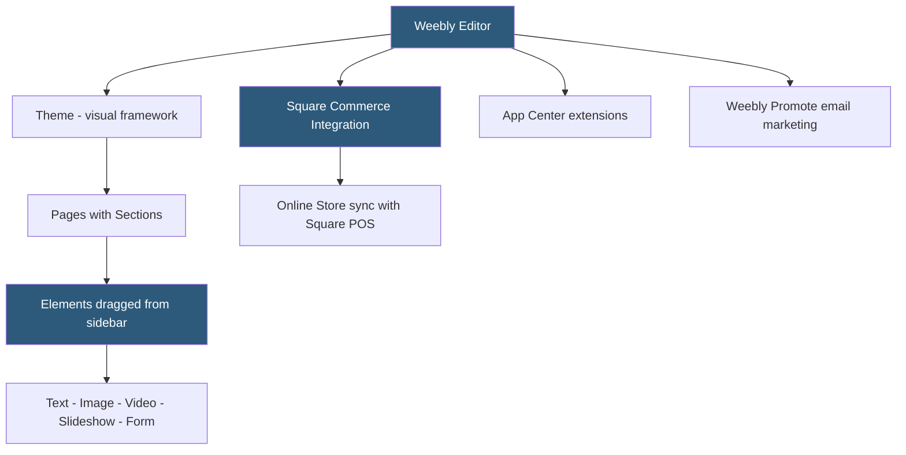

**Category:** Website Builder Platforms
**Difficulty:** Beginner
**Reading time:** 5 min read

---

Weebly is a drag-and-drop website builder acquired by Square in 2018 and now tightly integrated with Square's payment and commerce infrastructure. It targets small businesses, particularly those already using Square for in-person payments, enabling a seamless bridge between physical and online retail. Weebly's builder emphasizes simplicity and speed over design sophistication, making it a practical choice for non-technical users needing an e-commerce-enabled website quickly.

- **Weebly editor** — browser-based drag-and-drop builder where elements are dropped into sections of a page
- **element** — Weebly's term for content blocks (text, image, slideshow, video, map, contact form)
- **section** — predefined layout area on a page that accepts elements from the sidebar
- **Square integration** — native connection between Weebly stores and Square Point of Sale for unified inventory
- **Weebly App Center** — marketplace of third-party apps adding functionality to Weebly sites
- **theme** — Weebly's term for templates providing the overall visual structure of the site
- **Weebly Promote** — email marketing tool built into Weebly for sending campaigns to site contacts
- **mobile app** — Weebly iOS and Android app for editing sites and managing orders on mobile devices

Weebly's editor places elements by dragging from the left sidebar panel and dropping into predefined drop zones on the page canvas. Drop zones highlight when an element is dragged over them, indicating valid placement locations. This guided drag-and-drop is more constrained than Wix's free-position canvas — elements snap to section-based positions rather than any pixel coordinate. This constraint prevents common layout mistakes but limits design flexibility.

Each element in the sidebar represents a content type. Dropping a Text element creates a rich text field; dropping an Image element opens the image library for photo selection; dropping a Contact Form element inserts a form connected to the site's contact notification settings. More complex elements — product lists, gallery slideshows, countdown timers — are also available.

Square integration is Weebly's strongest differentiator. Businesses using Square for in-person payments can connect their Weebly store to sync inventory, pricing, and product data between the online store and the physical Square Point of Sale system. An item sold in-store automatically decrements the online inventory count, preventing overselling. Orders from both channels appear in a unified Square Dashboard.

The Weebly App Center provides third-party extensions for functionality not built into Weebly: OpenTable reservations, Disqus comments, Wufoo forms, and social media feeds. App quality varies; the marketplace is less curated than Squarespace Extensions.

Custom HTML/JavaScript can be embedded anywhere on a Weebly page using the Embed Code element, enabling advanced functionality or third-party widget integration.

- Small retailers already using Square POS who need an online store synced to in-person inventory
- Service businesses needing a simple contact-form website built in an afternoon
- Restaurants using Square payments wanting online ordering integrated with their existing system
- Sole proprietors who want to manage site edits from a mobile phone via the Weebly app
- Non-profits needing a simple informational website with a donation button

| Advantage | Disadvantage |
|-----------|--------------|
| Seamless Square POS inventory synchronization | Less design flexibility than Wix, Squarespace, or Webflow |
| Simple, constrained editor prevents layout mistakes | App Center smaller and less curated than competitors |
| Mobile app enables on-the-go site edits | Less active development since Square acquisition |
| Free tier includes basic e-commerce functionality | Template library smaller and less polished than Squarespace |

- [Weebly eCommerce Features](weebly-ecommerce-features.md)
- [GoDaddy Website Builder](godaddy-website-builder.md)
- [Squarespace Website Builder](squarespace-website-builder.md)

---
*Part of the [Website Builder Platforms](index.md) category · [Back to Master Index](../../index.md)*
