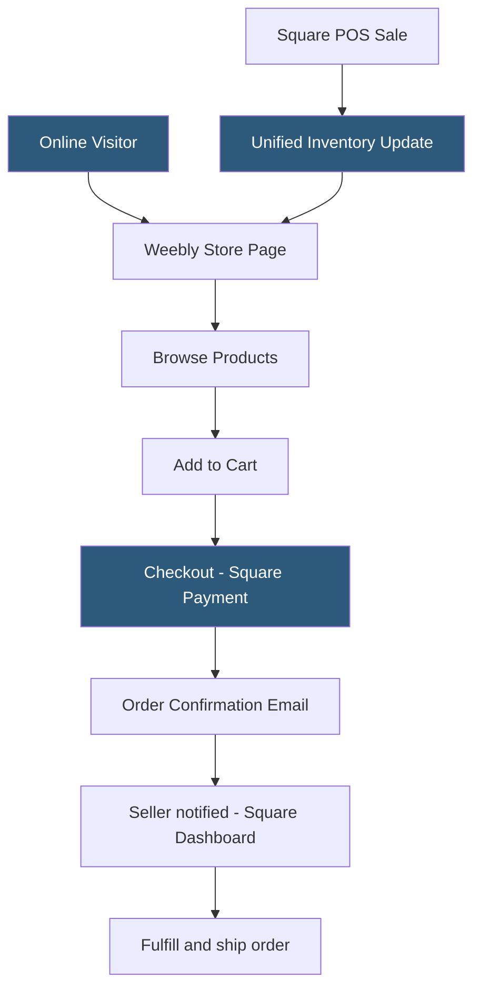

**Category:** Website Builder Platforms
**Difficulty:** Beginner
**Reading time:** 5 min read

---

Weebly's e-commerce capabilities, powered by Square, allow businesses to sell physical and digital products online with inventory management, multiple payment methods, and shipping calculation. The commerce features are tightly integrated with Square's payment infrastructure, giving in-person and online retailers a unified sales and inventory management system. Weebly's e-commerce is positioned for small to mid-size stores rather than high-volume enterprise retail.

- **Square Commerce** — the e-commerce backend powering Weebly stores, part of Square's commerce platform
- **product catalog** — collection of items for sale with names, descriptions, images, prices, and inventory counts
- **variant** — product option combination (size: M, color: Blue) creating a unique SKU
- **Square Payment Processing** — integrated card payment processing through Square's payment infrastructure
- **shipping rate** — per-order or per-item shipping cost calculation based on weight, price band, or carrier rates
- **digital download** — product type delivering a file to the buyer after purchase without physical fulfillment
- **abandoned cart email** — automated email sent to shoppers who added items but did not complete purchase
- **unified inventory** — shared product inventory tracked across both Weebly online store and Square POS

Weebly's store is enabled by adding an Online Store page. Products are created in the Store manager dashboard: each product has a title, description, images, price, and inventory tracking. Products support variants (size, color, material) with individual SKUs, pricing, and inventory counts per variant. A product with 3 sizes and 2 colors creates up to 6 variant SKUs.

Payment processing is handled by Square, requiring a Square account. Square charges processing fees on each transaction (standard card rate applies). PayPal can be added as an alternative payment method. Stripe is available on some Weebly plan tiers. The checkout flow is hosted on Weebly's servers, maintaining SSL throughout.

Shipping is configured with flat rate, weight-based, or carrier-calculated options. USPS, FedEx, and UPS carrier-calculated rates display real-time shipping quotes at checkout based on the order weight and destination. Free shipping thresholds can be set per shipping zone.

The Square inventory sync is the standout feature: when a product is sold via the Weebly online store, Square deducts it from inventory; when the same product is sold in-person through a Square POS device, it deducts from the same inventory count. This prevents an item appearing in-stock online when it just sold at the physical register.

Digital products deliver a download link in the order confirmation email without any physical fulfillment. The file is hosted by Weebly and the link expires after a configurable number of uses.

Abandoned cart recovery emails are available on higher-tier plans and automatically email shoppers who started checkout but did not complete the purchase, with the items in their cart.

- Retail store using Square POS adding an online channel with unified inventory
- Artisan selling handmade goods with limited quantities needing accurate inventory counts
- Musician selling digital downloads (albums, sheet music) with automated delivery
- Gym selling classes and merchandise through a unified online and in-person system
- Small boutique expanding from physical-only to omnichannel retail

| Advantage | Disadvantage |
|-----------|--------------|
| Square POS and online inventory unified without manual sync | Square processing fees are mandatory; no payment processor choice on lower plans |
| Digital downloads with automated delivery built in | Store customization less flexible than WooCommerce or Shopify |
| Abandoned cart emails on higher plans improve conversion | Transaction fees on Weebly e-commerce plans reduce margins |
| Multi-channel inventory prevents overselling | Advanced features (reviews, product filters) require third-party apps |

- [Weebly Drag-and-Drop Builder](weebly-drag-and-drop-builder.md)
- [Shopify Online Store Builder](shopify-online-store-builder.md)
- [BigCommerce Store Builder](bigcommerce-store-builder.md)

---
*Part of the [Website Builder Platforms](index.md) category · [Back to Master Index](../../index.md)*
