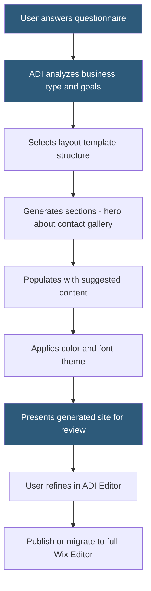

**Category:** Website Builder Platforms
**Difficulty:** Beginner
**Reading time:** 5 min read

---

Wix ADI (Artificial Design Intelligence) is an AI-powered website creation tool that generates a complete, personalized website in minutes by asking users a series of questions about their business, goals, and aesthetic preferences. It combines automated layout selection, content population, and template customization to remove the blank-canvas problem. ADI-generated sites can be further refined in a simplified editor or transferred to the full Wix Editor for advanced customization.

- **ADI** — AI system that generates website structure, layout, and initial content based on user input
- **business profile** — information collected during ADI setup (business type, name, contact details, goals)
- **content generation** — ADI's automatic population of placeholder text and suggested imagery based on business category
- **design theme** — color palette and font combination selected or suggested by ADI during setup
- **ADI Editor** — simplified editing interface for ADI-generated sites, more guided than the full Wix Editor
- **social media import** — ADI feature importing business information from Facebook, Yelp, or Google Business profiles
- **one-click redesign** — ADI capability regenerating the site's visual design while preserving content structure
- **Wix Editor migration** — transferring an ADI site to the full Wix Editor for advanced layout control

Wix ADI begins with a questionnaire asking for business name, category (restaurant, fitness studio, portfolio, etc.), desired features (contact form, gallery, online store, booking), and aesthetic preferences. If the user provides a social media URL, ADI can import existing business descriptions, photos, operating hours, and contact information from Facebook or Google Business, pre-populating the site with real content.

Based on the answers, ADI's algorithm selects an appropriate layout structure (typically a single-page scroll design or a multi-page site for businesses needing separate service and contact pages), assigns a harmonious color theme and font pairing, and generates section content for each identified need. The output is a functional website with real information in the correct sections, not a generic template requiring complete content replacement.

The ADI Editor presents a simplified interface compared to the full Wix Editor. Rather than free-form drag-and-drop positioning, users work with guided section editors: clicking a section reveals options to change text, swap images, adjust colors, or modify the section's layout from a curated set of variations. This constrained approach prevents design mistakes while remaining accessible to non-designers.

When users need functionality beyond ADI's capabilities — custom element positioning, Velo code, specific App Market integrations — they migrate the site to the full Wix Editor. This migration is one-way; the site converts to a standard Wix Editor project and cannot revert to ADI.

The "one-click redesign" feature demonstrates ADI's core concept: it regenerates the entire visual presentation using a different theme while preserving all text content and page structure, allowing rapid exploration of design directions.

- Absolute beginners who have never built a website and need something live quickly
- Business owners importing their existing Google Business profile to populate a professional site
- Testing multiple design directions with one-click redesign before committing
- Service businesses needing a simple booking or contact page without technical knowledge
- Small retailers needing a basic online presence in an afternoon

| Advantage | Disadvantage |
|-----------|--------------|
| Complete site in minutes without design knowledge | Less layout flexibility than full Wix Editor or pro builders |
| Social import reduces content creation effort | AI-generated copy often requires heavy editing for brand voice |
| One-click redesign enables rapid design exploration | Migration to full editor is irreversible |
| Guided editor prevents common design mistakes | Limited to Wix's curated section variations |

- [Wix Website Builder](wix-website-builder.md)
- [Wix Editor X Professional Platform](wix-editor-x-professional-platform.md)
- [Jimdo AI Website Builder](jimdo-ai-website-builder.md)

---
*Part of the [Website Builder Platforms](index.md) category · [Back to Master Index](../../index.md)*
