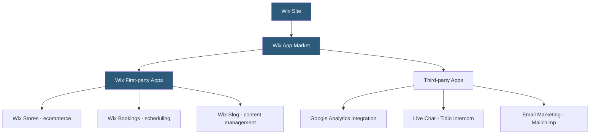

**Category:** Website Builder Platforms
**Difficulty:** Beginner
**Reading time:** 5 min read

---

The Wix App Market is an ecosystem of over 300 applications that extend Wix website functionality with pre-built features — e-commerce, scheduling, analytics, marketing, and social tools. Apps install with a single click and integrate directly into the site editor and dashboard. The marketplace includes both Wix's own business suite apps and third-party developer apps, with free and paid tiers.

- **Wix App Market** — official marketplace for installing apps that add functionality to Wix sites
- **Wix Business Solutions** — Wix's own apps: Stores, Bookings, Events, Blog, Forum, Members
- **third-party app** — application built by external developers published on the App Market
- **app dashboard** — management interface for an installed app, accessible from the Wix site dashboard sidebar
- **widget** — app-provided frontend element added to site pages by dragging from the Add Panel
- **permissions** — access controls apps request at install time for site data and user information
- **Wix App Builder** — developer platform for creating and publishing apps to the Wix App Market
- **deep integration** — apps that interact with other Wix features (e.g., Wix Stores connected to Wix Bookings)

Installing an app from the Wix App Market is a one-click operation. The app is added to the site, its management dashboard appears in the site's sidebar, and any page widgets it provides become available in the editor's Add Panel. Most apps provide both a backend management dashboard (accessible from the Wix site manager) and one or more frontend widgets that display the app's content on site pages.

Wix's first-party apps are the most deeply integrated. Wix Stores, when installed, adds product catalog management, a shopping cart, checkout flow, order management, and payment processing — all managed through the Stores dashboard. Store product pages are automatically created and connected to the site's navigation. Similarly, Wix Bookings adds a scheduling interface, staff management, calendar integration, and a booking widget for site pages.

Third-party apps connect Wix sites to external services. A live chat app like Tidio injects a chat widget into every page using a Wix-provided script injection mechanism. Email marketing apps like Mailchimp connect Wix form submissions to Mailchimp lists. These integrations use Wix's OAuth-based app authentication to access site data on behalf of the user.

App permissions define what site data an app can access. At install time, users review and approve permissions (e.g., "access your contacts", "read your products"). This permission model prevents apps from accessing data beyond their declared scope.

The Wix App Builder platform allows developers to create new apps using Wix's CLI, defining widgets, dashboard pages, and backend services that integrate with the Wix platform.

- Adding a live chat widget to a Wix site for customer support
- Connecting a Wix contact form to a Mailchimp audience for email list building
- Installing Wix Stores to add an online shop without leaving the Wix ecosystem
- Adding Google Analytics or Facebook Pixel tracking via dedicated apps
- Implementing a loyalty points program through a third-party rewards app

| Advantage | Disadvantage |
|-----------|--------------|
| One-click installation without code or server configuration | App quality varies; reviews and ratings require careful evaluation |
| Wix first-party apps deeply integrated with site and dashboard | Third-party apps may slow site load if poorly optimized |
| Permissions model provides visibility into data access | Less flexible than custom-coded solutions for unique requirements |
| Free tiers on many apps reduce cost barrier | App subscriptions can add significant monthly cost across multiple apps |

- [Wix Website Builder](wix-website-builder.md)
- [Wix SEO Wiz Optimization](wix-seo-wiz-optimization.md)
- [Squarespace Extensions Marketplace](squarespace-extensions-marketplace.md)

---
*Part of the [Website Builder Platforms](index.md) category · [Back to Master Index](../../index.md)*
