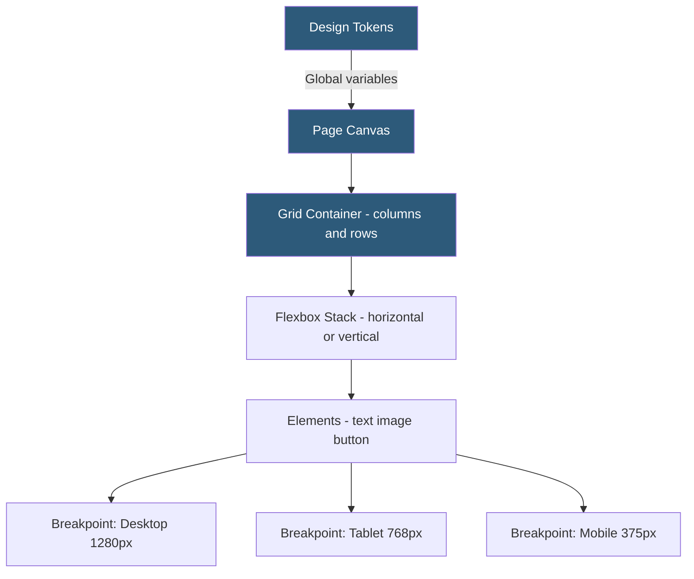

**Category:** Website Builder Platforms
**Difficulty:** Intermediate
**Reading time:** 6 min read

---

Wix Editor X (rebranded as Wix Studio) is Wix's professional-grade design platform targeting web designers and agencies. Unlike the classic Wix Editor's absolute-position canvas, Editor X uses CSS Grid and Flexbox-based layout systems that produce genuinely responsive designs that adapt fluidly across breakpoints. It adds a collaborative workspace, advanced typography controls, and client handoff tools that make it viable for agency workflows.

- **Wix Studio** — current branding for what launched as Editor X; Wix's platform for professional designers
- **CSS Grid layout** — column-and-row grid system used by Editor X for responsive element placement
- **Flexbox stack** — horizontal or vertical container that automatically distributes space among children
- **breakpoint** — screen width threshold where the layout adjusts (mobile, tablet, desktop custom)
- **design tokens** — reusable design variables (colors, fonts, spacing) applied globally across the site
- **workspace** — team environment in Wix Studio where collaborators can work on shared client projects
- **client handoff** — feature allowing designers to transfer completed sites to clients with controlled editor access
- **Wix Velo compatibility** — Editor X sites support the full Wix Velo JavaScript API layer

Editor X replaces the classic Wix Editor's absolute pixel positioning with a layout system based on CSS Grid and Flexbox containers. A page is built by placing containers onto the canvas, defining their grid columns and rows, then placing elements inside. This produces markup where element positions are defined relative to the container grid — enabling true responsive behavior when the viewport narrows or widens.

Containers in Editor X are either grid containers (defining rows and columns with configurable fractions, pixels, or auto) or Flexbox stacks (aligning children horizontally or vertically with gap, alignment, and wrapping controls). Elements placed inside inherit responsive positioning from their parent container. This is a fundamentally different approach from Wix Classic, where each element has independent pixel coordinates that simply scale proportionally on different screens.

Breakpoint management allows designers to define layout changes at specific viewport widths rather than just the three default sizes. Custom breakpoints enable tablet-landscape or wide-desktop layouts. Changes at a narrower breakpoint cascade down to smaller sizes; changes must be explicitly overridden at each breakpoint where different behavior is desired.

The workspace feature provides team accounts where multiple designers can access client projects. Role-based access controls allow collaborators to edit content without touching design settings, and viewers to review without editing. Client handoff grants the client a simplified interface for updating text and images without access to the design layer.

Editor X sites support the full Wix Velo development platform, meaning complex interactivity, custom databases, and backend API functions can be added to professionally designed layouts.

- Web design agencies building responsive client sites within the Wix ecosystem
- Freelance designers who want responsive CSS Grid-based layouts without hand-coding
- Marketing agencies requiring client collaboration and site handoff workflows
- Designers building complex multi-page sites with consistent design token systems
- Portfolio sites requiring fluid responsive typography and image grid layouts

| Advantage | Disadvantage |
|-----------|--------------|
| CSS Grid and Flexbox produce genuinely responsive layouts | Steeper learning curve than classic Wix Editor |
| Design tokens enable consistent branding across large sites | Smaller template library than classic Wix Editor |
| Collaboration and client handoff features support agency workflows | Cannot switch between Editor X and classic Editor once committed |
| Custom breakpoints enable fine-grained responsive control | Still subject to Wix platform constraints vs self-hosted solutions |

- [Wix Website Builder](wix-website-builder.md)
- [Wix Velo Development Platform](wix-velo-development-platform.md)
- [Webflow Visual Development](webflow-visual-development.md)

---
*Part of the [Website Builder Platforms](index.md) category · [Back to Master Index](../../index.md)*
