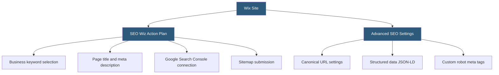

**Category:** Website Builder Platforms
**Difficulty:** Beginner
**Reading time:** 5 min read

---

Wix SEO Wiz is a guided SEO optimization tool embedded in the Wix platform that creates a personalized SEO plan based on the site's business type and goals. It walks users through completing on-page optimization tasks — meta tags, page titles, descriptions, structured data, and Google Search Console connection — with step-by-step instructions accessible to non-technical site owners. Wix also provides advanced SEO settings for custom markup and canonicalization.

- **Wix SEO Wiz** — guided SEO setup tool generating a personalized action plan for Wix sites
- **meta title** — HTML `<title>` tag content controlling how a page appears in search engine results
- **meta description** — `<meta name="description">` content shown as the search result snippet
- **Google Search Console** — Google's webmaster tool for monitoring search performance, indexing, and crawl errors
- **sitemap.xml** — auto-generated file listing all site URLs for search engine discovery
- **canonical URL** — `<link rel="canonical">` tag declaring the preferred URL for a page to prevent duplicate content issues
- **structured data** — JSON-LD markup adding schema.org annotations (LocalBusiness, Product, Article) to help search engines understand content
- **robot tags** — per-page directives controlling whether search engines index and follow links on that page

Wix SEO Wiz activates through the site's Marketing & SEO dashboard. It opens with a brief interview asking the user to identify their main business keyword and location (for local SEO). Based on these inputs, the Wiz generates a prioritized checklist of optimization tasks, organized into "quick wins" and longer-term tasks.

The checklist guides users through: writing a keyword-rich page title and meta description for the homepage, ensuring all key pages have unique titles and descriptions, connecting the site to Google Search Console (through a guided OAuth flow), and submitting the auto-generated sitemap.xml. The Wiz displays the site's search presence directly in the Wix dashboard once Search Console is connected, showing impressions, clicks, and indexing status.

Every Wix page has an SEO settings panel (accessible via Page SEO in page properties) where users set the page title, meta description, and social share image. Advanced SEO mode unlocks additional fields: custom JSON-LD structured data input, canonical URL override, and robot meta tag settings (noindex, nofollow) per page.

Wix automatically handles several technical SEO factors: it generates and keeps the sitemap.xml current as pages are added or removed, sets canonical tags to prevent www/non-www duplicate content issues, and adds hreflang tags for multilingual sites.

Wix's SEO limitations compared to WordPress: the URL slug structure is constrained to specific patterns, redirects must be managed through Wix's redirect tool, and JavaScript rendering means some search engine crawlers may not see dynamic content immediately.

- New business owners setting up their first Wix site and learning SEO basics
- Local businesses configuring LocalBusiness structured data for Google Maps presence
- Bloggers ensuring each post has a unique meta description and canonical URL
- E-commerce stores marking products with Product schema for Google Shopping appearance
- Agencies performing SEO audits on client Wix sites using the SEO checklist

| Advantage | Disadvantage |
|-----------|--------------|
| Guided workflow accessible to non-technical users | Less fine-grained SEO control than WordPress SEO plugins (Yoast) |
| Automatic sitemap and canonical tag management | URL structure more constrained than self-hosted CMS platforms |
| Google Search Console integration in the site dashboard | JavaScript rendering can delay search engine discovery of dynamic content |
| Structured data support without coding for common schemas | Redirect management less powerful than server-level redirect control |

- [Wix Website Builder](wix-website-builder.md)
- [Squarespace Website Builder](squarespace-website-builder.md)
- [Wix App Market Integrations](wix-app-market-integrations.md)

---
*Part of the [Website Builder Platforms](index.md) category · [Back to Master Index](../../index.md)*
