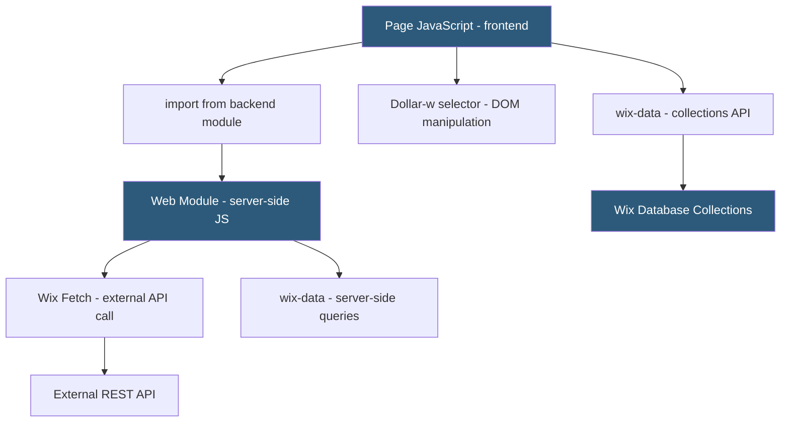

**Category:** Website Builder Platforms
**Difficulty:** Advanced
**Reading time:** 6 min read

---

Wix Velo is the JavaScript development platform built into Wix, enabling developers to add custom frontend interactions, backend functions, database collections, and external API integrations to Wix sites without leaving the editor. Velo bridges the gap between Wix's no-code builder and a full-stack web application, giving developers programmatic control over page elements, data, routing, and server-side logic.

- **Velo IDE** — browser-based code editor embedded in the Wix editor sidebar for writing page and backend JavaScript
- **$w() selector** — Velo API function selecting page elements by ID for programmatic manipulation
- **wix-data** — Wix database API for reading and writing to content collections from frontend or backend code
- **web module** — Velo server-side JavaScript file running in Wix's cloud backend, accessible from frontend via `import`
- **Wix Fetch** — server-side HTTP client in Velo for calling external REST APIs from backend code
- **Router** — Velo API for creating dynamic URL patterns that load data before rendering the page
- **secrets manager** — Wix feature storing API keys and credentials accessed by backend code without exposure in source
- **npm packages** — Velo supports importing select npm packages in backend modules

Velo activates a JavaScript IDE panel within the Wix editor. Each page has a page code file where developers write event handlers and data manipulation logic. The `$w()` function selects page elements by their IDs (set in the editor's element properties panel) and exposes a rich API: `$w('#submitButton').onClick()`, `$w('#emailInput').value`, `$w('#dataTable').rows = data`. This bridges visual editor design with programmatic control.

Wix data collections are schematized databases with a visual schema editor. The `wix-data` API allows CRUD operations from both frontend and backend: `wix-data.query('Products').eq('category', 'shoes').find()` returns matching records. Access controls on collections determine whether frontend code can read/write directly or must go through backend modules.

Backend modules (files in the `backend/` folder with `.jsw` extension) run on Wix's cloud servers. Frontend code imports functions from backend modules, which execute server-side. This pattern is used for API calls requiring secret keys: the frontend calls a backend function, the backend uses Wix's secrets manager to retrieve the API key, calls the external service, and returns a sanitized result to the frontend. The API key is never exposed in client-side code.

The Router API creates dynamic URL patterns for data-driven pages. A router at `/products/{slug}` intercepts requests, queries the database for a matching product, and passes the data to a page template before rendering — enabling SEO-friendly URLs for dynamic content without requiring a server-side framework.

Velo is a proprietary platform tightly coupled to Wix; code cannot be exported or migrated to other hosting environments.

- Building a job board where listings are stored in Wix collections and searchable with custom filters
- Adding a custom checkout experience that calls an external payment API from backend code
- Creating member portals with Wix Members and custom data visible only after login
- Connecting a Wix form submission to a CRM via backend HTTP calls without exposing API keys
- Building dynamic catalog pages with router URLs for SEO and filtered product browsing

| Advantage | Disadvantage |
|-----------|--------------|
| Full-stack capabilities without leaving Wix ecosystem | Code cannot be exported; tight vendor lock-in |
| Secrets manager prevents API key exposure in frontend | Velo environment limitations; not all npm packages supported |
| Browser-based IDE lowers dev environment setup barrier | Performance of complex Velo apps less predictable than dedicated servers |
| wix-data provides visual schema editor alongside code | Debugging tools less mature than browser DevTools for standard apps |

- [Wix Website Builder](wix-website-builder.md)
- [Wix Editor X Professional Platform](wix-editor-x-professional-platform.md)
- [Webflow Logic Automation](webflow-logic-automation.md)

---
*Part of the [Website Builder Platforms](index.md) category · [Back to Master Index](../../index.md)*
