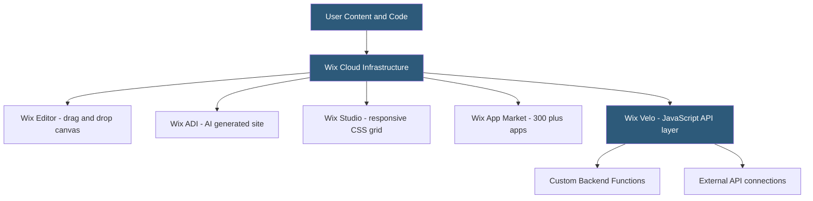

**Category:** Website Builder Platforms
**Difficulty:** Beginner
**Reading time:** 5 min read

---

Wix is a cloud-based website builder offering a drag-and-drop editor, hundreds of templates, and an integrated hosting and domain platform. It serves over 250 million users and targets small businesses, creatives, and entrepreneurs who need professional websites without coding. Wix provides three editing experiences: the classic Wix Editor, the AI-powered ADI, and the professional-grade Editor X (Wix Studio).

- **Wix Editor** — drag-and-drop canvas editor where elements are positioned with absolute freedom on a grid
- **Wix ADI** — AI-powered builder that generates a personalized site from answers to a brief questionnaire
- **Wix Studio (Editor X)** — professional responsive editor for designers and agencies with CSS grid controls
- **Wix App Market** — marketplace of first-party and third-party apps extending site functionality
- **Wix Velo** — JavaScript development platform for adding custom code and APIs to Wix sites
- **dynamic pages** — Wix pages connected to a content database collection, generating URLs from data
- **Wix Business Solutions** — suite including Wix Bookings, Wix Stores, Wix Events, and Wix Blog
- **freemium** — Wix's pricing model offering a free tier with Wix branding on the subdomain

Wix operates as a fully hosted platform — users create and edit their site entirely within the Wix browser editor, with no server setup, FTP access, or file management required. The editor presents a canvas representing the web page, where elements (text, images, buttons, galleries, forms) are placed by dragging from a sidebar panel and positioned precisely using on-canvas alignment guides.

Wix uses a proprietary page format stored in Wix's cloud. When a visitor loads a site, Wix's servers render the page and deliver it over a global CDN. This means site performance is partly dependent on Wix's platform rather than user-controlled server configuration.

Templates provide starting points organized by industry (restaurant, portfolio, online store). Once a template is chosen, it cannot be changed without starting over — a significant limitation compared to CMS platforms. Elements within templates are fully customizable: text, colors, fonts, images, and layouts can all be modified without affecting other pages.

Wix's App Market extends functionality through apps that integrate with the site editor. Wix's own business apps (Bookings for appointments, Stores for e-commerce, Events for ticketing) are deeply integrated. Third-party apps connect to external services. The Wix Velo platform allows developers to write JavaScript both on the front end and in serverless backend functions, querying Wix databases or external APIs.

SEO capabilities include a Wix SEO Wiz tool guiding users through optimization steps, custom meta tags per page, structured data support, and automatic sitemap generation.

- Small business websites for restaurants, salons, and retail stores
- Photographer and artist portfolio sites with gallery-focused templates
- Service businesses using Wix Bookings for online appointment scheduling
- Event promoters using Wix Events for ticketing and RSVP management
- Freelance designers building client sites quickly using templates

| Advantage | Disadvantage |
|-----------|--------------|
| No hosting, server, or technical setup required | Cannot migrate site content to another platform easily |
| Hundreds of templates across all industries | Template cannot be changed after initial selection |
| App Market extends functionality without coding | Performance less optimizable than self-hosted solutions |
| Free tier enables testing before committing to paid | Wix branding on free tier; custom domain requires paid plan |

- [Wix ADI Artificial Design Intelligence](wix-adi-artificial-design-intelligence.md)
- [Wix Velo Development Platform](wix-velo-development-platform.md)
- [Wix App Market Integrations](wix-app-market-integrations.md)

---
*Part of the [Website Builder Platforms](index.md) category · [Back to Master Index](../../index.md)*
