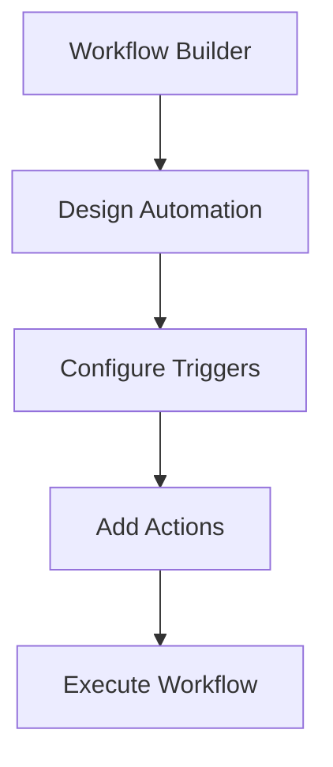

**Category:** Workflow Automation Platforms
**Difficulty:** Intermediate
**Reading time:** 6 min read

---

Activepieces is an open-source workflow automation platform designed as an alternative to Zapier and Make.com. It provides a user-friendly interface for building automations with the flexibility of open-source software.

- **Open-Source Architecture** — Fully open code available for review and modification
- **Community-Driven** — Active community contributing integrations and features
- **Self-Hosting** — Deploy on your own infrastructure
- **Cloud Option** — Managed hosting available without self-hosting burden
- **Integration Library** — Growing collection of pre-built connectors

Activepieces uses a visual workflow editor similar to other automation platforms. Users design workflows by connecting triggers to actions with data transformations. The open-source nature means you can extend it with custom integrations. Either self-host for complete control or use their cloud platform for convenience.

- Organizations wanting open-source automation
- Teams with specific customization requirements
- Deployment in restricted environments
- Cost-conscious automation needs
- Integration with proprietary systems

| Advantage | Disadvantage |
|-----------|--------------|
| Completely open-source | Smaller ecosystem than Zapier |
| Self-hosting available | Less mature platform |
| Customizable architecture | Community support over commercial |

- [Activepieces drag-and-drop builder](activepieces-drag-and-drop-builder.md)
- [Activepieces self-hosted option](activepieces-self-hosted-option.md)
- [n8n workflow automation (open-source)](n8n-workflow-automation-open-source.md)

---
*Part of the [Workflow Automation Platforms](workflow-automation-platforms/index.md) category · [Back to Master Index](../../index.md)*
