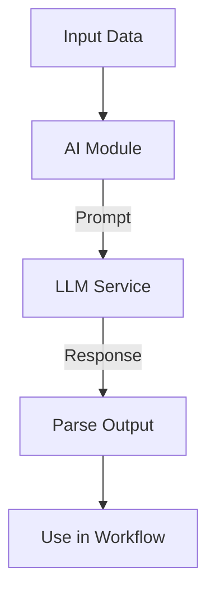

**Category:** Workflow Automation Platforms
**Difficulty:** Intermediate
**Reading time:** 6 min read

---

Make.com provides direct integrations with AI services like OpenAI and Claude, enabling automated workflows that leverage large language models for text generation, analysis, and intelligent decision-making.

- **OpenAI Module** — Direct integration with GPT models
- **Claude Integration** — Access to Claude AI capabilities
- **Prompt Design** — Crafting effective prompts for AI models
- **Token Limits** — Understanding API usage and costs
- **Response Handling** — Processing and using AI-generated content

AI modules accept text input, formulate prompts, and send requests to AI services. Results are returned as text that can be parsed, analyzed, and fed into subsequent workflow steps. You configure API keys, set parameters like temperature and max tokens, and design prompts that extract the information you need. The modules handle authentication and API communication automatically.

- Summarizing email content for quick scanning
- Extracting structured data from unstructured text
- Generating automated responses based on queries
- Classification and sentiment analysis
- Content generation for emails and documents

| Advantage | Disadvantage |
|-----------|--------------|
| Powerful AI capabilities | API costs per request |
| Native integration | Token limits to manage |
| Easy prompt configuration | Variable response quality |

- [Make.com scenarios and modules](makecom-scenarios-and-modules.md)
- [Make.com Apps marketplace](makecom-apps-marketplace.md)
- [Zapier AI chatbots](zapier-ai-chatbots.md)

---
*Part of the [Workflow Automation Platforms](workflow-automation-platforms/index.md) category · [Back to Master Index](../../index.md)*
