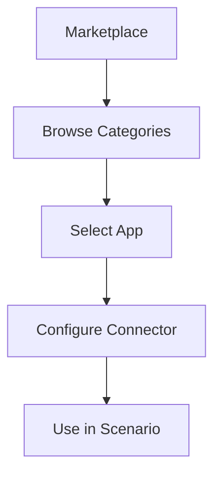

**Category:** Workflow Automation Platforms
**Difficulty:** Intermediate
**Reading time:** 6 min read

---

Make.com's apps marketplace provides integrations with hundreds of applications and services. The marketplace includes official integrations and community-built connectors, expanding the platform's capabilities continuously.

- **Marketplace** — Centralized catalog of available integrations
- **Pre-built Connectors** — Official integrations with major applications
- **Community Integrations** — User-created connectors for niche services
- **Integration Quality** — Varying levels of completeness and support
- **App Discovery** — Tools for finding integrations for your use case

The Make.com marketplace features hundreds of pre-built connectors that abstract API complexity. Official connectors receive regular updates and support. Community integrations provide alternatives for less common apps. Each connector exposes relevant triggers and actions for that service. The marketplace includes rating and review systems to help users find quality integrations.

- Finding integrations for business applications
- Discovering alternatives to standard connectors
- Building workflows with specialized or niche apps
- Exploring new integration possibilities
- Accessing community-built solutions

| Advantage | Disadvantage |
|-----------|--------------|
| Large selection of integrations | Quality varies by connector |
| Community contributions expand coverage | Community connectors less reliable |
| Regular updates | Some popular apps still missing |

- [Make.com scenarios and modules](makecom-scenarios-and-modules.md)
- [Make.com AI modules (OpenAI, Claude)](makecom-ai-modules-openai-claude.md)
- [Zapier app integrations (6000+)](zapier-app-integrations-6000.md)

---
*Part of the [Workflow Automation Platforms](workflow-automation-platforms/index.md) category · [Back to Master Index](../../index.md)*
