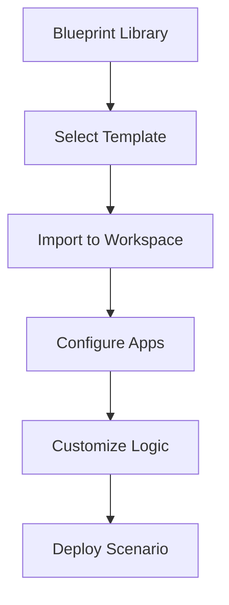

**Category:** Workflow Automation Platforms
**Difficulty:** Intermediate
**Reading time:** 6 min read

---

Make.com blueprint templates are pre-built scenario templates that can be imported and customized for common automation tasks. These templates accelerate workflow creation by providing proven patterns and configurations.

- **Blueprint Library** — Collection of pre-built scenario templates
- **Import Process** — Adding blueprints to your Make.com workspace
- **Customization** — Adapting templates to your specific needs
- **Use Case Examples** — Scenarios for common business processes
- **Community Blueprints** — Templates shared by Make.com users

Blueprints provide starter scenarios for common automation tasks. You browse the library, find a relevant template, and import it into your workspace. The template includes modules configured for a specific use case, but you customize the app connections and field mappings for your situation. This significantly reduces setup time compared to building scenarios from scratch.

- Quick implementation of common workflows
- Learning Make.com by example
- Getting started with specific integrations
- Jumpstarting complex multi-app scenarios
- Sharing automation patterns with team members

| Advantage | Disadvantage |
|-----------|--------------|
| Accelerates setup significantly | May need modification |
| Provides best-practice examples | Limited customization options |
| Easy for beginners | May not fit exact requirements |

- [Make.com scenarios and modules](makecom-scenarios-and-modules.md)
- [Make.com Apps marketplace](makecom-apps-marketplace.md)
- [n8n visual workflow editor](../workflow-automation-platforms/n8n-visual-workflow-editor.md)

---
*Part of the [Workflow Automation Platforms](workflow-automation-platforms/index.md) category · [Back to Master Index](../../index.md)*
