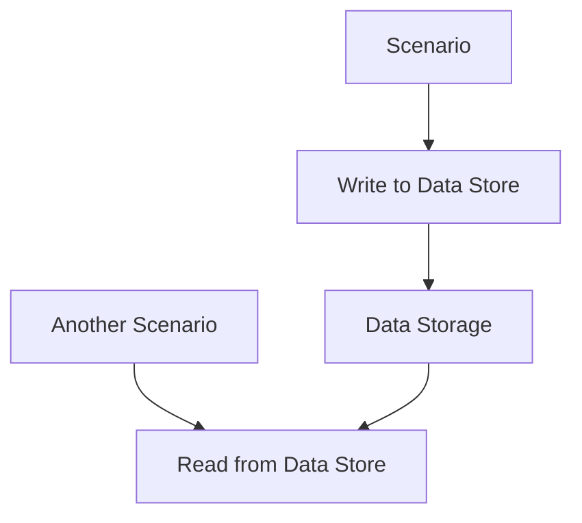

**Category:** Workflow Automation Platforms
**Difficulty:** Intermediate
**Reading time:** 6 min read

---

Make.com data stores provide a lightweight database solution for scenarios to store and retrieve data during workflow execution. This enables maintaining state, caching information, and sharing data between scenario runs.

- **Data Structure** — Hierarchical storage for scenario data
- **Key-Value Storage** — Simple association of keys with values
- **Retrieval Operations** — Methods to fetch stored data
- **Update Mechanisms** — Modifying existing stored values
- **Cross-Scenario Access** — Sharing data between different scenarios

Data stores act as a simple NoSQL database integrated into Make.com. Each scenario can write key-value pairs to its data store during execution. Subsequent scenarios or iterations can retrieve these values for decision-making or processing. The data persists between scenario runs, making it ideal for maintaining state or counters across executions. Make.com provides modules specifically for managing data store operations.

- Storing pagination cursors for API requests
- Maintaining counters or running totals
- Caching expensive API lookups
- Sharing configuration between scenarios
- Tracking workflow state for long-running processes

| Advantage | Disadvantage |
|-----------|--------------|
| Integrated with scenarios | Limited query capabilities |
| Simple key-value access | No complex filtering |
| Persists across runs | Storage limits per tier |

- [Make.com iterators and arrays](makecom-iterators-and-arrays.md)
- [Make.com webhooks and HTTP modules](makecom-webhooks-and-http-modules.md)
- [Zapier Tables database](zapier-tables-database.md)

---
*Part of the [Workflow Automation Platforms](workflow-automation-platforms/index.md) category · [Back to Master Index](../../index.md)*
