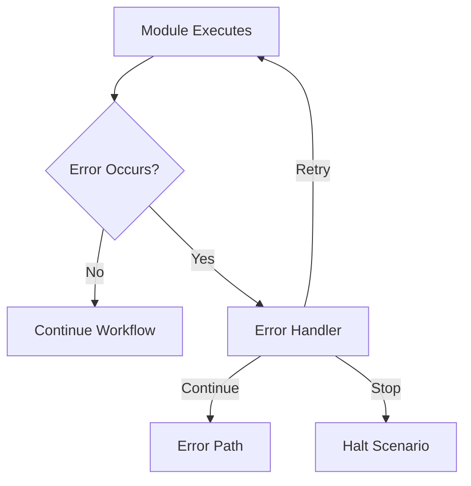

**Category:** Workflow Automation Platforms
**Difficulty:** Intermediate
**Reading time:** 6 min read

---

Error handling in Make.com ensures workflows continue operating smoothly despite unexpected failures. The platform provides multiple strategies for detecting, logging, and recovering from errors during scenario execution.

- **Error Routes** — Alternative paths when modules fail
- **Continue on Error** — Module setting to prevent scenario termination
- **Catch Blocks** — Specific error handling segments in workflows
- **Error Information** — Details about what went wrong and why
- **Retry Logic** — Automatic attempts to recover from failures

Make.com allows configuring how modules respond to errors. You can set modules to continue despite failures, route to error handlers, or stop the scenario. Error blocks can log information, send notifications, or attempt recovery. The platform tracks all errors in execution history, helping you debug issues. Advanced error handling includes retry logic with backoff strategies for transient failures.

- Gracefully handling API timeout errors
- Logging failures for debugging and alerting
- Continuing workflow with partial data when some records fail
- Implementing fallback actions
- Building resilient automated processes

| Advantage | Disadvantage |
|-----------|--------------|
| Prevents scenario halt | Complex error handling increases setup time |
| Detailed error information | Error paths can make workflows harder to read |
| Flexible recovery options | Wrong error handling may mask issues |

- [Make.com scenarios and modules](makecom-scenarios-and-modules.md)
- [Make.com routers and aggregators](makecom-routers-and-aggregators.md)
- [n8n error workflows](../workflow-automation-platforms/n8n-error-workflows.md)

---
*Part of the [Workflow Automation Platforms](workflow-automation-platforms/index.md) category · [Back to Master Index](../../index.md)*
