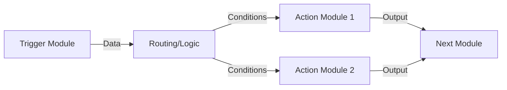

**Category:** Workflow Automation Platforms
**Difficulty:** Intermediate
**Reading time:** 6 min read

---

Make.com (formerly Integromat) is a visual automation platform that enables users to create complex workflows without coding. Its advanced visual editor and powerful features make it suitable for sophisticated automation requirements beyond basic task automation.

- **Visual Scenario Builder** — Drag-and-drop interface for designing workflows
- **Module-Based Architecture** — Individual components that handle specific operations
- **Data Mapping** — Visual connections between module outputs and inputs
- **Complex Logic** — Support for advanced conditional branching and loops
- **Real-time Execution** — Workflows run immediately when triggered, not on schedules

Make.com uses a module-based architecture where each piece of functionality is a distinct module. Users connect modules together visually, with data flowing from one to the next. The platform executes workflows in real-time, allowing immediate feedback. Modules can branch based on conditions, loop through data sets, and aggregate results. The visual editor shows the complete workflow logic at a glance, making complex automations understandable and maintainable.

- Building complex multi-step workflows
- Creating workflows with advanced conditional logic
- Handling data transformation across multiple systems
- Automating processes with loops and iterations
- Building intelligent routing systems

| Advantage | Disadvantage |
|-----------|--------------|
| More powerful than Zapier for complex scenarios | Steeper learning curve |
| Better for advanced logic | Can be slower than code for simple tasks |
| Visual workflow overview | Requires more setup time |

- [Make.com scenarios and modules](makecom-scenarios-and-modules.md)
- [Make.com routers and aggregators](makecom-routers-and-aggregators.md)
- [Zapier app integrations (6000+)](zapier-app-integrations-6000.md)

---
*Part of the [Workflow Automation Platforms](workflow-automation-platforms/index.md) category · [Back to Master Index](../../index.md)*
