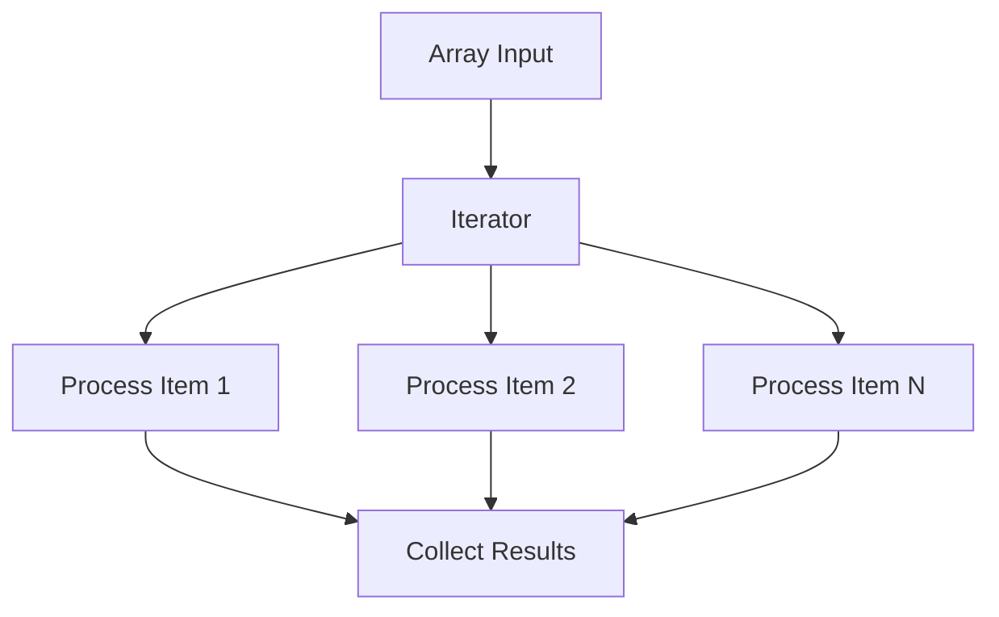

**Category:** Workflow Automation Platforms
**Difficulty:** Intermediate
**Reading time:** 6 min read

---

Iterators and arrays in Make.com enable you to process multiple items in a single workflow execution. This capability is essential for handling collections of data, loops, and bulk operations without creating separate workflow instances.

- **Iterator Module** — Loops through arrays and processes each item individually
- **Array Handling** — Working with collections of data in workflows
- **Bundle Splitting** — Breaking arrays into separate bundles for processing
- **Looping Logic** — Repeating operations for each array item
- **Array Building** — Constructing new arrays from workflow operations

The iterator module takes an array of data and creates a separate bundle for each item. Each bundle flows through subsequent modules individually, allowing the same operations to apply to each element. Results are collected back together, creating new arrays based on the processed items. This pattern enables bulk operations, data transformations across arrays, and complex loops within a single scenario execution.

- Processing multiple CSV rows in a single workflow run
- Applying the same operation to multiple items from a list
- Building new arrays from transformed data
- Looping through API results without making separate requests
- Batch processing of database records

| Advantage | Disadvantage |
|-----------|--------------|
| Efficient bulk processing | Can consume more operation points |
| Simplifies complex logic | Requires understanding array structure |
| Better performance than loops | Debugging array operations challenging |

- [Make.com routers and aggregators](makecom-routers-and-aggregators.md)
- [Make.com data stores](makecom-data-stores.md)
- [Make.com error handling](makecom-error-handling.md)

---
*Part of the [Workflow Automation Platforms](workflow-automation-platforms/index.md) category · [Back to Master Index](../../index.md)*
