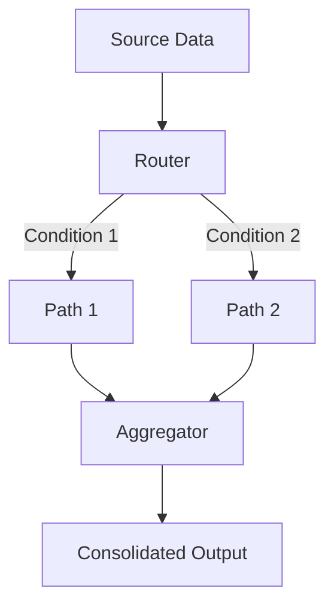

**Category:** Workflow Automation Platforms
**Difficulty:** Intermediate
**Reading time:** 6 min read

---

Routers and aggregators are advanced Make.com modules that enable complex workflow logic. Routers direct data along different paths based on conditions, while aggregators combine multiple data streams into unified outputs.

- **Router Module** — Conditional branching that directs data to different workflow paths
- **Aggregator Module** — Combines multiple bundles of data into a single output
- **Bundles** — Individual data packages that flow through modules
- **Conditional Routing** — Logic-based decisions on which path data takes
- **Data Consolidation** — Merging results from parallel workflow branches

Routers evaluate conditions and direct bundles to appropriate modules, enabling parallel processing. Multiple paths can execute simultaneously, each handling different data or scenarios. Aggregators then collect outputs from these paths and combine them into a single bundle or array. This allows complex workflow logic that processes different data types differently, then consolidates results for final actions.

- Routing customer data to different departments based on criteria
- Processing multiple file types differently in a single workflow
- Consolidating data from multiple sources for bulk operations
- Implementing approval chains with alternate paths
- Parallel processing with final consolidation

| Advantage | Disadvantage |
|-----------|--------------|
| Enables complex logic | More difficult to visualize |
| Efficient parallel processing | Requires careful configuration |
| Powerful data consolidation | Debugging can be challenging |

- [Make.com iterators and arrays](makecom-iterators-and-arrays.md)
- [Make.com error handling](makecom-error-handling.md)
- [Make.com scenarios and modules](makecom-scenarios-and-modules.md)

---
*Part of the [Workflow Automation Platforms](workflow-automation-platforms/index.md) category · [Back to Master Index](../../index.md)*
