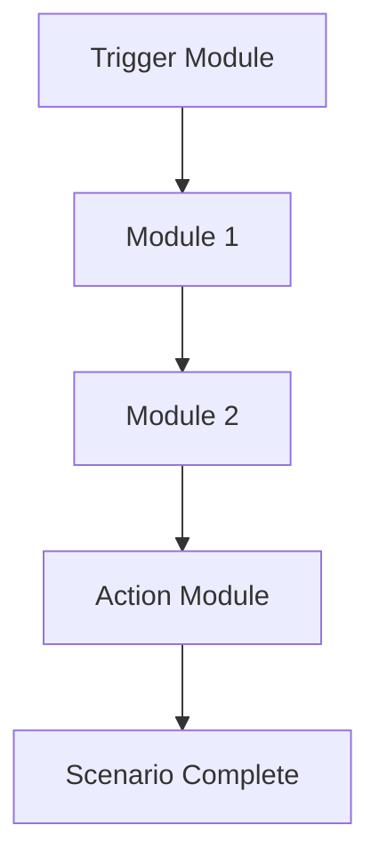

**Category:** Workflow Automation Platforms
**Difficulty:** Intermediate
**Reading time:** 6 min read

---

Scenarios are the core workflow units in Make.com, composed of individual modules that perform specific operations. Understanding scenarios and modules is fundamental to building automation on the Make.com platform.

- **Scenario** — A complete workflow composed of connected modules
- **Module** — Individual components that handle specific operations or integrations
- **Triggers** — Modules that initiate scenario execution based on events
- **Actions** — Modules that perform operations in external applications
- **Transformers** — Modules that modify data without external dependencies

Each Make.com scenario starts with a trigger module that watches for specific events. When an event occurs, the scenario executes sequentially through connected modules. Each module receives input data, processes it according to its configuration, and passes output to subsequent modules. Modules can be reused across multiple scenarios, and you can create your own custom modules. The platform provides extensive debugging tools to monitor data flow and identify issues.

- Automating data synchronization between applications
- Creating approval workflows with human intervention
- Building data transformation pipelines
- Scheduling recurring operations
- Integrating multiple SaaS applications

| Advantage | Disadvantage |
|-----------|--------------|
| Flexible module combinations | Can become complex visually |
| Powerful transformation capabilities | Steep learning curve for advanced features |
| Extensive integration library | Performance considerations at scale |

- [Make.com routers and aggregators](makecom-routers-and-aggregators.md)
- [Make.com iterators and arrays](makecom-iterators-and-arrays.md)
- [Make.com webhooks and HTTP modules](makecom-webhooks-and-http-modules.md)

---
*Part of the [Workflow Automation Platforms](workflow-automation-platforms/index.md) category · [Back to Master Index](../../index.md)*
