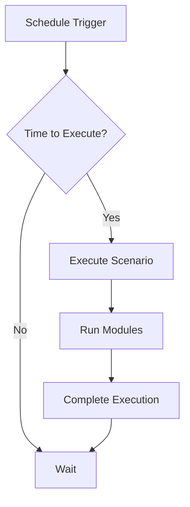

**Category:** Workflow Automation Platforms
**Difficulty:** Intermediate
**Reading time:** 6 min read

---

Make.com's scheduling capabilities allow scenarios to run on specific times or intervals without external triggers. This enables recurring automations like data synchronization, reporting, and maintenance tasks.

- **Schedule Trigger** — Module that initiates scenarios on time-based schedules
- **Interval Setting** — How frequently the scenario runs (minutes, hours, days)
- **Specific Time** — Running scenarios at exact times daily or weekly
- **Timezone Support** — Scheduling in specific time zones
- **Cron Expressions** — Advanced scheduling using cron syntax

Schedule modules act as timers that fire scenarios based on configured intervals or specific times. You can set scenarios to run every 5 minutes, daily at 3 AM, or on specific days of the week. Make.com handles timezone conversions automatically, ensuring consistent execution across regions. The platform tracks execution history and allows manual scenario triggers between scheduled runs.

- Daily data backup and synchronization
- Scheduled reporting and email distribution
- Recurring cleanup or maintenance operations
- Time-based monitoring and alerts
- Periodic API data collection

| Advantage | Disadvantage |
|-----------|--------------|
| No external trigger needed | Less immediate than event-based |
| Reliable scheduling | Minimum 5-minute intervals |
| Flexible interval options | Timezone confusion possible |

- [Make.com scenarios and modules](makecom-scenarios-and-modules.md)
- [Make.com webhooks and HTTP modules](makecom-webhooks-and-http-modules.md)
- [Zapier pricing tiers and task limits](zapier-pricing-tiers-and-task-limits.md)

---
*Part of the [Workflow Automation Platforms](workflow-automation-platforms/index.md) category · [Back to Master Index](../../index.md)*
