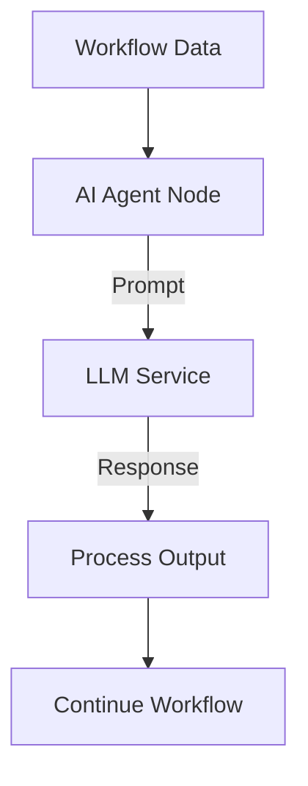

**Category:** Workflow Automation Platforms
**Difficulty:** Intermediate
**Reading time:** 6 min read

---

n8n's AI agent nodes integrate artificial intelligence capabilities directly into workflows. These nodes enable intelligent decision-making, content generation, and automated reasoning within your automation systems.

- **AI Service Integration** — Connection to LLM providers like OpenAI
- **Agent Logic** — AI-driven decision making in workflows
- **Prompt Engineering** — Crafting effective instructions for AI models
- **Token Management** — Controlling API costs and limits
- **Response Handling** — Processing and using AI-generated outputs

AI agent nodes send data to language models with specific instructions (prompts). The model processes the input and returns responses that can be parsed and used in subsequent workflow steps. You configure which AI service to use, set parameters like temperature and token limits, and define how responses should be processed. Results integrate seamlessly with other workflow operations.

- Intelligent customer query classification
- Automated content generation from templates
- Data extraction from unstructured text
- Email response suggestions
- Dynamic decision-making based on context

| Advantage | Disadvantage |
|-----------|--------------|
| Powerful AI capabilities | API costs per request |
| Enables intelligent automation | Response quality varies |
| Easy integration | Requires API credentials |

- [n8n workflow automation (open-source)](n8n-workflow-automation-open-source.md)
- [n8n JavaScript code execution](n8n-javascript-code-execution.md)
- [Make.com AI modules (OpenAI, Claude)](../workflow-automation-platforms/makecom-ai-modules-openai-claude.md)

---
*Part of the [Workflow Automation Platforms](workflow-automation-platforms/index.md) category · [Back to Master Index](../../index.md)*
