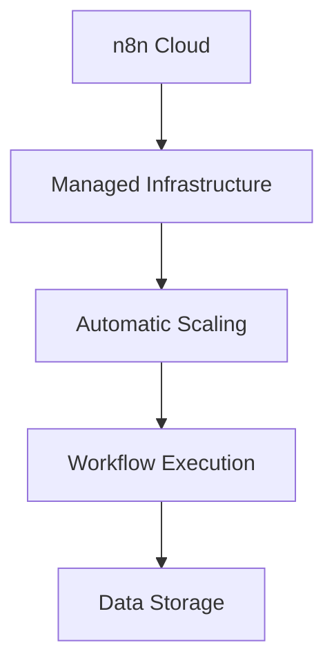

**Category:** Workflow Automation Platforms
**Difficulty:** Intermediate
**Reading time:** 6 min read

---

n8n Cloud is the hosted version of n8n, eliminating deployment and maintenance overhead while retaining the flexibility and features of the open-source platform. It offers a middle ground between self-hosted and SaaS platforms.

- **Managed Hosting** — n8n handles infrastructure and maintenance
- **Automatic Scaling** — Platform scales automatically with demand
- **Backup and Recovery** — Built-in data protection and disaster recovery
- **Team Collaboration** — Multi-user workspace management
- **Regular Updates** — Automatic platform updates without manual intervention

n8n Cloud provides a fully managed platform hosted on n8n's infrastructure. Users access the platform through a browser, create workflows, and manage executions without worrying about underlying infrastructure. The platform handles authentication, backups, and updates automatically. Your data is stored securely with redundancy and recovery mechanisms.

- Organizations wanting n8n features without deployment complexity
- Teams needing multi-user collaboration
- Businesses avoiding infrastructure management
- Projects requiring automatic scaling
- Development teams wanting managed hosting

| Advantage | Disadvantage |
|-----------|--------------|
| No infrastructure management | Data stored on n8n servers |
| Automatic scaling and updates | Higher cost than self-hosted |
| Built-in backup and recovery | Less customization than self-hosted |

- [n8n workflow automation (open-source)](n8n-workflow-automation-open-source.md)
- [n8n self-hosted deployment](n8n-self-hosted-deployment.md)
- [n8n visual workflow editor](n8n-visual-workflow-editor.md)

---
*Part of the [Workflow Automation Platforms](workflow-automation-platforms/index.md) category · [Back to Master Index](../../index.md)*
