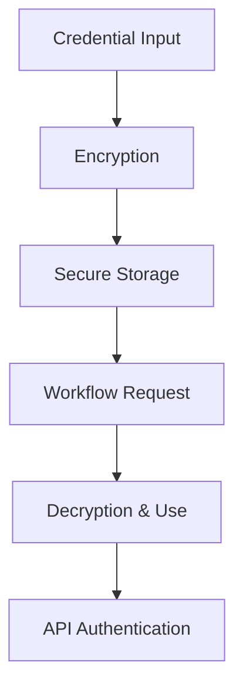

**Category:** Workflow Automation Platforms
**Difficulty:** Intermediate
**Reading time:** 6 min read

---

Secure credential management in n8n ensures API keys, passwords, and sensitive authentication information are protected. n8n provides built-in systems for storing and using credentials safely across workflows.

- **Credential Storage** — Encrypted storage of authentication information
- **Credential Types** — Support for various authentication schemes
- **Scope and Access** — Controlling who can use stored credentials
- **Rotation Policies** — Updating credentials on schedules
- **Audit Logging** — Tracking credential usage and access

n8n encrypts credentials before storage and only decrypts them when needed during workflow execution. Each node configured with credentials references the secure credential rather than containing the actual secret. Access permissions control which workflows and users can access specific credentials. The system logs all credential usage for audit trails.

- Managing API keys for multiple integrations
- Rotating credentials on schedules
- Controlling access to sensitive authentication
- Audit trails for compliance requirements
- Sharing workflows without exposing secrets

| Advantage | Disadvantage |
|-----------|--------------|
| Secure encrypted storage | Adds setup complexity |
| Granular access control | Requires regular rotation |
| Audit logging included | Performance overhead minimal |

- [n8n workflow automation (open-source)](n8n-workflow-automation-open-source.md)
- [n8n self-hosted deployment](n8n-self-hosted-deployment.md)
- [n8n custom nodes development](n8n-custom-nodes-development.md)

---
*Part of the [Workflow Automation Platforms](workflow-automation-platforms/index.md) category · [Back to Master Index](../../index.md)*
