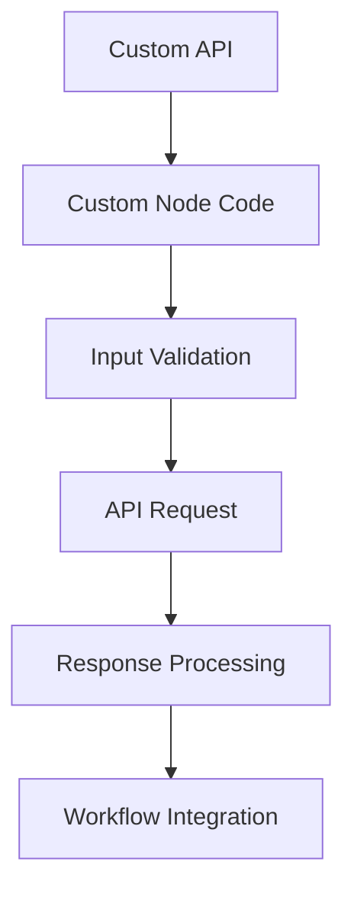

**Category:** Workflow Automation Platforms
**Difficulty:** Intermediate
**Reading time:** 6 min read

---

n8n's custom nodes allow developers to create specialized integration components for systems not covered by the standard node library. Custom nodes extend n8n's functionality for proprietary or niche applications.

- **Node Structure** — Anatomy of custom node code
- **Input/Output Configuration** — Defining node data interfaces
- **Authentication Implementation** — Handling custom auth schemes
- **Error Handling** — Robust error management in nodes
- **Testing Framework** — Tools for validating custom nodes

Developers create custom nodes using TypeScript, following n8n's node structure. Each custom node exports trigger and action functions that n8n executes. The node defines input parameters, output data structure, and authentication requirements. Testing tools allow validating custom nodes against real APIs before deployment. Completed nodes can be shared or kept private.

- Creating integrations for proprietary APIs
- Building connectors for legacy systems
- Developing specialized data transformation nodes
- Creating internal company-specific nodes
- Contributing to the n8n community

| Advantage | Disadvantage |
|-----------|--------------|
| Full customization | Requires development expertise |
| Access to all API capabilities | Maintenance burden |
| Community contribution opportunity | Testing complexity |

- [n8n workflow automation (open-source)](n8n-workflow-automation-open-source.md)
- [n8n JavaScript code execution](n8n-javascript-code-execution.md)
- [Zapier custom apps and developer platform](../workflow-automation-platforms/zapier-custom-apps-and-developer-platform.md)

---
*Part of the [Workflow Automation Platforms](workflow-automation-platforms/index.md) category · [Back to Master Index](../../index.md)*
