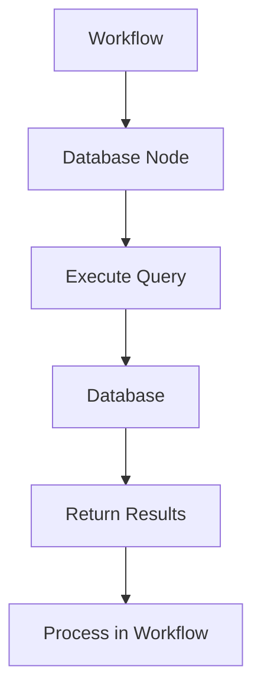

**Category:** Workflow Automation Platforms
**Difficulty:** Intermediate
**Reading time:** 6 min read

---

n8n provides direct integration with multiple database systems including PostgreSQL, MySQL, MongoDB, and others. These integrations enable workflows to read from and write to databases efficiently.

- **Database Connectors** — Pre-built connections to popular databases
- **Query Execution** — Running SQL or database-specific queries
- **CRUD Operations** — Create, read, update, delete data operations
- **Connection Pooling** — Efficient database resource management
- **Error Handling** — Managing database-specific errors

Database nodes connect to your database using stored credentials. You write queries specific to your database system (SQL for relational databases, MongoDB queries for non-relational). The node executes the query and returns results as data flowing through the workflow. This enables reading records, inserting new data, updating existing records, or aggregating information.

- Querying data for workflow decisions
- Inserting workflow results into databases
- Synchronizing data between systems and databases
- Updating records based on external events
- Reporting and aggregating database data

| Advantage | Disadvantage |
|-----------|--------------|
| Direct database access | Requires database knowledge |
| High performance | Complex queries need expertise |
| Full database capability access | Direct access requires security care |

- [n8n workflow automation (open-source)](n8n-workflow-automation-open-source.md)
- [n8n JavaScript code execution](n8n-javascript-code-execution.md)
- [Zapier Tables database](../workflow-automation-platforms/zapier-tables-database.md)

---
*Part of the [Workflow Automation Platforms](workflow-automation-platforms/index.md) category · [Back to Master Index](../../index.md)*
