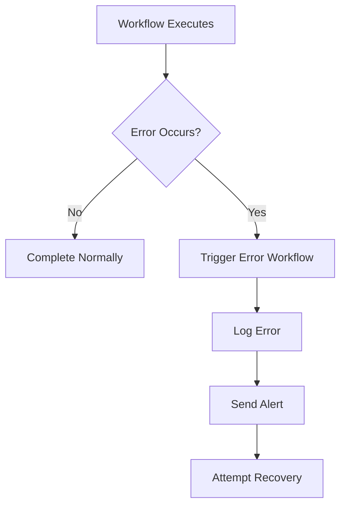

**Category:** Workflow Automation Platforms
**Difficulty:** Intermediate
**Reading time:** 6 min read

---

n8n's error workflows handle failures gracefully, allowing automated recovery, logging, and notifications when workflow steps fail. This ensures your automations remain robust and provides visibility into issues.

- **Error Workflow Trigger** — Activating workflows when errors occur
- **Error Information** — Accessing details about what went wrong
- **Recovery Mechanisms** — Automatic retry strategies
- **Alerting** — Notifying teams of workflow failures
- **Logging and Monitoring** — Tracking error patterns

When a workflow step fails, n8n can trigger a dedicated error workflow instead of stopping execution. The error workflow receives information about what failed and can log details, send notifications, or attempt recovery. Error workflows enable building resilient automation systems that respond intelligently to problems rather than simply failing.

- Alerting teams when automations fail
- Logging errors for debugging and analysis
- Attempting automatic recovery of failed operations
- Rollingback failed transactions or changes
- Monitoring workflow health and success rates

| Advantage | Disadvantage |
|-----------|--------------|
| Graceful error handling | Added complexity to workflows |
| Improved visibility into issues | Requires error handling design |
| Enables recovery automation | Potential infinite loops if misconfigured |

- [n8n workflow automation (open-source)](n8n-workflow-automation-open-source.md)
- [n8n webhooks and HTTP requests](n8n-webhooks-and-http-requests.md)
- [Make.com error handling](../workflow-automation-platforms/makecom-error-handling.md)

---
*Part of the [Workflow Automation Platforms](workflow-automation-platforms/index.md) category · [Back to Master Index](../../index.md)*
