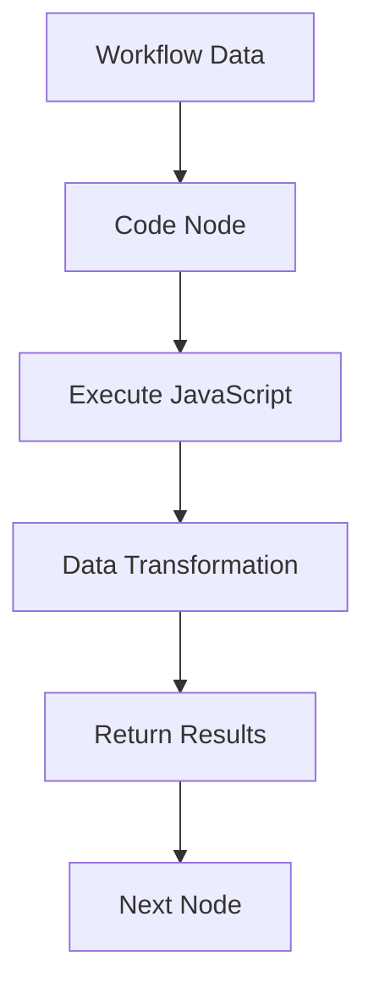

**Category:** Workflow Automation Platforms
**Difficulty:** Intermediate
**Reading time:** 6 min read

---

n8n allows direct JavaScript code execution within workflows through specialized code nodes. This enables complex data transformations, conditional logic, and calculations beyond visual node capabilities.

- **Code Node** — Executes JavaScript code within workflows
- **Data Access** — Working with incoming workflow data in code
- **JavaScript Syntax** — Standard JavaScript with access to common libraries
- **Error Handling** — Catching and managing code execution errors
- **Performance** — Optimization for efficient code execution

Code nodes receive incoming data from previous workflow steps and allow writing arbitrary JavaScript to transform it. You have access to the data, libraries, and can perform complex calculations or logic. The code returns a value that becomes the node's output. Errors in code halt the workflow unless configured otherwise. This provides maximum flexibility for handling edge cases or custom logic.

- Complex data transformations not possible with UI nodes
- Mathematical calculations or formatting logic
- Conditional workflows based on custom logic
- Data parsing from unstructured responses
- Advanced filtering or manipulation

| Advantage | Disadvantage |
|-----------|--------------|
| Unlimited code flexibility | Requires JavaScript knowledge |
| Solves complex logic problems | Code maintenance burden |
| Powerful transformation capability | Slower than visual nodes |

- [n8n visual workflow editor](n8n-visual-workflow-editor.md)
- [n8n custom nodes development](n8n-custom-nodes-development.md)
- [Make.com scenarios and modules](../workflow-automation-platforms/makecom-scenarios-and-modules.md)

---
*Part of the [Workflow Automation Platforms](workflow-automation-platforms/index.md) category · [Back to Master Index](../../index.md)*
