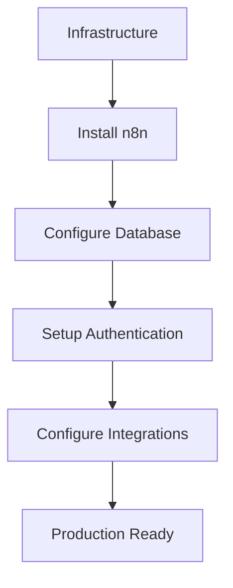

**Category:** Workflow Automation Platforms
**Difficulty:** Intermediate
**Reading time:** 6 min read

---

Deploying n8n on your own infrastructure provides complete control over your automation environment. Self-hosted n8n can run on various platforms including Docker, Kubernetes, or traditional servers.

- **Docker Deployment** — Containerized n8n installation
- **Environment Configuration** — Setting up databases and services
- **Security Hardening** — Securing self-hosted instances
- **Scaling Considerations** — Multi-instance deployments for high volume
- **Backup and Recovery** — Protecting workflow and data

n8n deployment begins with choosing infrastructure (Docker, cloud VM, Kubernetes). You configure environment variables, database connections, and authentication methods. The platform stores workflows and execution history in your database. Proper security configuration includes HTTPS, authentication, and firewall rules. Ongoing maintenance involves monitoring, updates, and backups.

- Healthcare organizations requiring HIPAA compliance
- Financial services needing data residency
- Enterprise deployments with specific security requirements
- High-volume automation needing custom scaling
- Integration with on-premises systems

| Advantage | Disadvantage |
|-----------|--------------|
| Complete data control | Requires IT infrastructure skills |
| No data leaves organization | Maintenance and patching burden |
| Unlimited customization | Scaling complexity increases costs |

- [n8n workflow automation (open-source)](n8n-workflow-automation-open-source.md)
- [n8n Cloud hosted service](n8n-cloud-hosted-service.md)
- [n8n credentials management](n8n-credentials-management.md)

---
*Part of the [Workflow Automation Platforms](workflow-automation-platforms/index.md) category · [Back to Master Index](../../index.md)*
