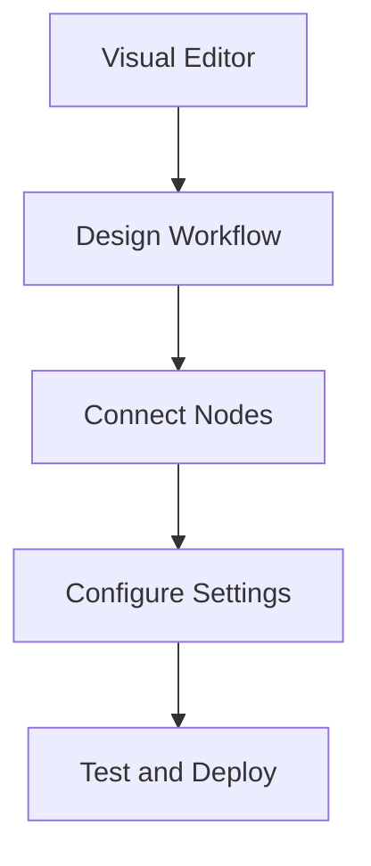

**Category:** Workflow Automation Platforms
**Difficulty:** Intermediate
**Reading time:** 6 min read

---

n8n's visual workflow editor allows you to build complex automations using a drag-and-drop interface. The editor provides a clear representation of workflow logic while supporting advanced features for power users.

- **Node-Based Interface** — Drag-and-drop workflow composition
- **Connection Visualization** — Visual representation of data flow
- **Configuration Panels** — Easy access to node settings
- **Workflow Testing** — Built-in testing and debugging tools
- **Version Control** — Track workflow changes over time

The visual editor presents workflows as connected nodes that represent operations. You drag nodes from the library, configure them, and connect output from one to input of the next. The editor shows the complete workflow visually, making logic easy to understand. Built-in debugging displays data passing between nodes, helping identify issues quickly.

- Building complex workflows with multiple paths
- Debugging workflow issues visually
- Learning automation by visualization
- Collaborating with non-technical team members
- Understanding existing workflows

| Advantage | Disadvantage |
|-----------|--------------|
| Very intuitive interface | Complex workflows become visually cluttered |
| Excellent for debugging | Can be slower than code-based approaches |
| Great visualization | Limited to visual editing (no code mode) |

- [n8n workflow automation (open-source)](n8n-workflow-automation-open-source.md)
- [n8n JavaScript code execution](n8n-javascript-code-execution.md)
- [Make.com (Integromat) visual automation](../workflow-automation-platforms/makecom-integromat-visual-automation.md)

---
*Part of the [Workflow Automation Platforms](workflow-automation-platforms/index.md) category · [Back to Master Index](../../index.md)*
