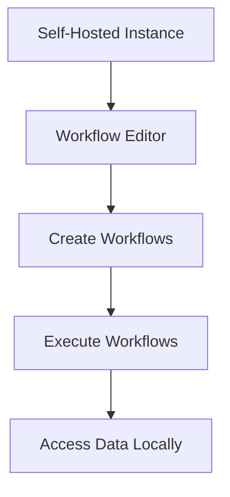

**Category:** Workflow Automation Platforms
**Difficulty:** Intermediate
**Reading time:** 6 min read

---

n8n is an open-source workflow automation platform that offers significant control and flexibility. Unlike Zapier and Make.com, n8n can be self-hosted, providing data privacy and customization advantages for organizations with specific requirements.

- **Open-Source Architecture** — Code available for review and modification
- **Self-Hosting Option** — Deploy on your own infrastructure
- **Community-Driven Development** — User contributions and feature requests
- **Workflow Definition** — JSON-based workflow configuration
- **Extensibility** — Ability to create custom nodes and modifications

n8n runs on your own servers or cloud infrastructure, giving you complete control over your data and customization options. The platform uses a visual workflow editor similar to Make.com but with open-source flexibility. You can modify the platform code, create custom nodes for proprietary systems, and integrate it with your existing infrastructure. The community provides numerous pre-built integrations and extensions.

- Organizations requiring data residency compliance
- Scenarios needing custom node development
- Companies wanting to modify platform behavior
- Self-hosted automation environments
- Integration with proprietary systems

| Advantage | Disadvantage |
|-----------|--------------|
| Complete control and privacy | Requires deployment and maintenance |
| Customizable and extensible | Smaller marketplace than Zapier |
| No vendor lock-in | More technical setup required |

- [n8n self-hosted deployment](n8n-self-hosted-deployment.md)
- [n8n Cloud hosted service](n8n-cloud-hosted-service.md)
- [Make.com (Integromat) visual automation](makecom-integromat-visual-automation.md)

---
*Part of the [Workflow Automation Platforms](workflow-automation-platforms/index.md) category · [Back to Master Index](../../index.md)*
