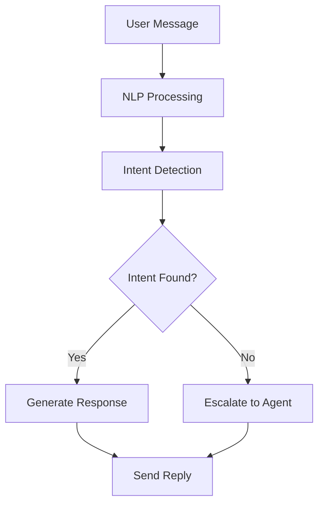

**Category:** Workflow Automation Platforms
**Difficulty:** Intermediate
**Reading time:** 6 min read

---

Zapier AI chatbots integrate artificial intelligence capabilities to automate customer conversations and support inquiries. These chatbots can understand natural language, provide intelligent responses, and seamlessly hand off conversations to human agents when needed.

- **Natural Language Processing** — Understanding and interpreting user intent from messages
- **Intent Matching** — Mapping user messages to appropriate responses or actions
- **Context Awareness** — Maintaining conversation history and relevant context
- **Handoff Automation** — Seamless transfer to human agents with conversation history
- **Training Data** — Knowledge base for the chatbot to draw responses from

Zapier AI chatbots process incoming messages through natural language understanding to identify user intent. The system matches queries against trained knowledge bases and response templates. When confidence is high, the chatbot responds directly. For ambiguous or out-of-scope requests, the chatbot escalates to human representatives with full conversation context. The system learns from interactions and can be continuously improved through feedback and additional training data.

- Providing 24/7 customer support for common inquiries
- Automating FAQ responses for support channels
- Qualifying leads through conversational questionnaires
- Handling appointment scheduling or cancellations
- Providing product information and guidance

| Advantage | Disadvantage |
|-----------|--------------|
| Always available | Limited to training data quality |
| Reduces support costs | May require escalation for complex issues |
| Improves response times | Initial setup and training effort |

- [Zapier Interfaces form builder](zapier-interfaces-form-builder.md)
- [Make.com AI modules (OpenAI, Claude)](../workflow-automation-platforms/makecom-ai-modules-openai-claude.md)
- [n8n AI agent nodes](../workflow-automation-platforms/n8n-ai-agent-nodes.md)

---
*Part of the [Workflow Automation Platforms](workflow-automation-platforms/index.md) category · [Back to Master Index](../../index.md)*
