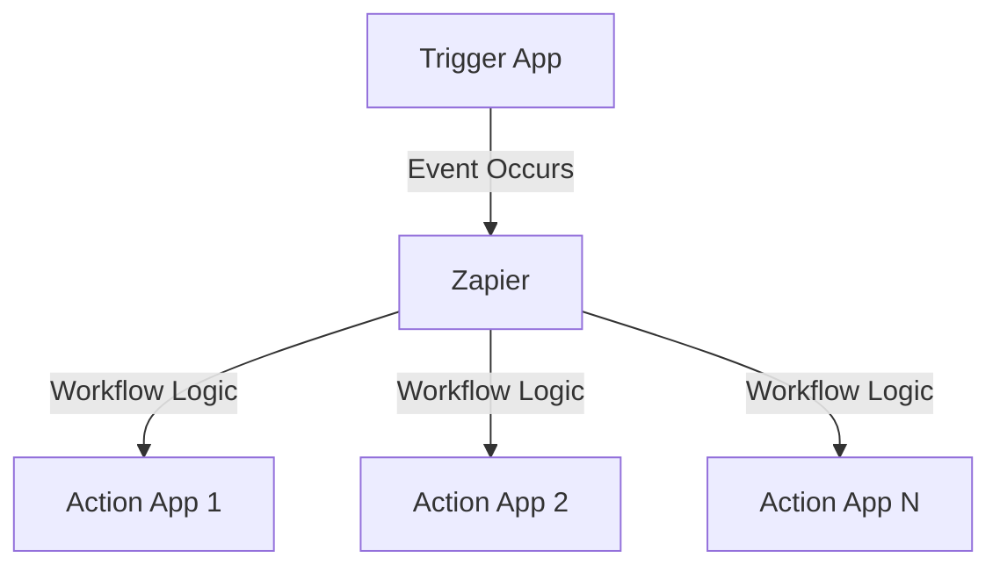

**Category:** Workflow Automation Platforms
**Difficulty:** Intermediate
**Reading time:** 6 min read

---

Zapier offers integrations with over 6000 applications, making it one of the most comprehensive automation platforms available. This massive app ecosystem enables you to connect virtually any business tool to create powerful workflows without custom coding.

- **App Library** — Catalog of 6000+ pre-built integrations
- **Trigger Actions** — Events from apps that start workflows
- **Action Steps** — What happens in other apps as a result
- **Search & Filters** — Finding appropriate integrations for your use case
- **Integration Quality** — Some apps have complete integration while others have limited functionality

Zapier maintains official integrations with major applications through direct API connections. These integrations expose the most commonly used triggers and actions from each app. You select a trigger app, choose the event that should start the workflow, then add actions in other apps. Zapier handles authentication and data mapping between applications automatically. Regular updates ensure integrations remain compatible with app updates.

- Connecting CRM systems to email marketing platforms
- Syncing project management tools with communication apps
- Automating data collection across multiple services
- Creating pipelines that involve 5+ different applications
- Building cross-platform workflow automations

| Advantage | Disadvantage |
|-----------|--------------|
| Extremely broad coverage | Some apps have limited triggers/actions |
| Official integrations | No custom integration support |
| Regular updates | Quality varies by integration depth |

- [Zapier custom apps and developer platform](zapier-custom-apps-and-developer-platform.md)
- [Zapier pricing tiers and task limits](zapier-pricing-tiers-and-task-limits.md)
- [Make.com Apps marketplace](../workflow-automation-platforms/makecom-apps-marketplace.md)

---
*Part of the [Workflow Automation Platforms](workflow-automation-platforms/index.md) category · [Back to Master Index](../../index.md)*
