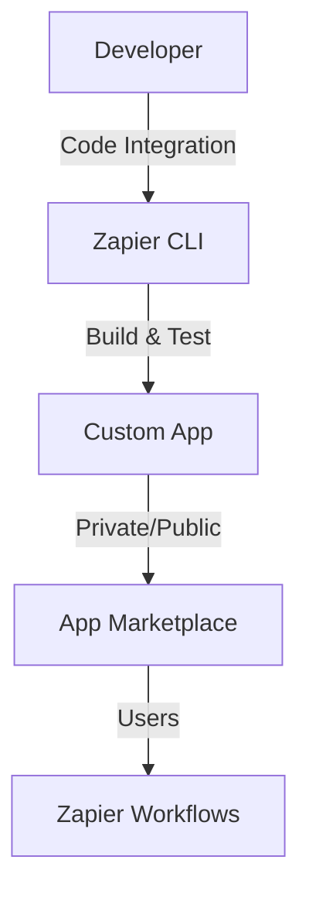

**Category:** Workflow Automation Platforms
**Difficulty:** Intermediate
**Reading time:** 6 min read

---

Zapier's developer platform allows you to create custom integrations for proprietary or niche applications. This feature enables developers to build private or public integrations that extend Zapier's capabilities beyond its standard 6000+ app library.

- **Zapier CLI** — Command-line tools for building and deploying custom integrations
- **Authentication Methods** — Support for OAuth, API keys, and custom auth schemes
- **Trigger Types** — Polling and webhook-based custom triggers
- **Action Implementation** — Creating custom actions that interact with APIs
- **Validation & Testing** — Tools to ensure custom apps function correctly

Developers use Zapier's CLI to scaffold a new integration project with authentication and sample triggers/actions. The SDK abstracts API communication and data handling. Developers implement specific trigger or action endpoints, define data schemas, and add error handling. The CLI includes testing tools to validate functionality before deployment. Custom apps can be kept private for internal use or submitted to the public marketplace for other Zapier users.

- Integrating proprietary business systems with Zapier
- Creating integrations for internal APIs
- Building public integrations for SaaS products
- Automating legacy system integrations
- Extending Zapier functionality for unique use cases

| Advantage | Disadvantage |
|-----------|--------------|
| Unlimited customization | Requires development expertise |
| Access to all API capabilities | Maintenance burden for developers |
| Private or public distribution | Vetting process for public apps |

- [Zapier app integrations (6000+)](zapier-app-integrations-6000.md)
- [n8n custom nodes development](../workflow-automation-platforms/n8n-custom-nodes-development.md)
- [Make.com Apps marketplace](../workflow-automation-platforms/makecom-apps-marketplace.md)

---
*Part of the [Workflow Automation Platforms](workflow-automation-platforms/index.md) category · [Back to Master Index](../../index.md)*
