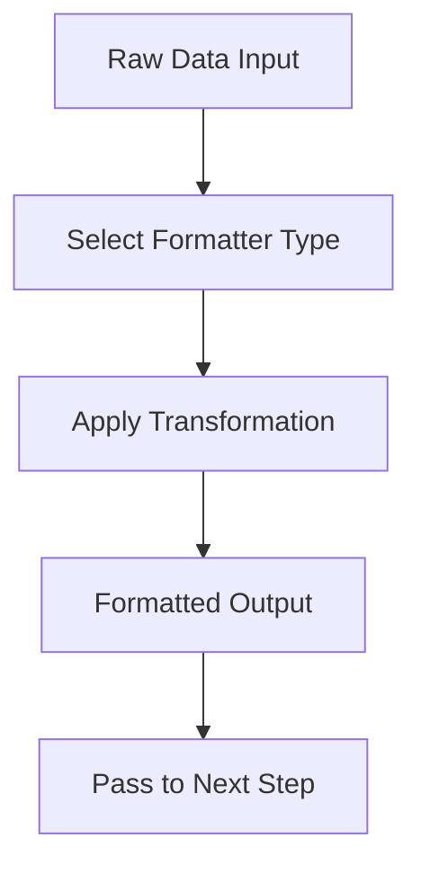

**Category:** Workflow Automation Platforms
**Difficulty:** Intermediate
**Reading time:** 6 min read

---

Zapier formatters and utilities are built-in tools that transform and manipulate data within automated workflows. These features allow you to modify text, numbers, dates, and other data types without requiring custom code, making complex automations accessible to non-technical users.

- **Text Formatter** — Tools for manipulating strings, including uppercase, lowercase, trimming, and text replacement
- **Number Formatter** — Conversion and formatting of numeric values with decimal places and thousand separators
- **Date/Time Formatter** — Conversion between date formats, timezone adjustments, and timestamp handling
- **Utilities Module** — Additional helper functions for JSON parsing, URL encoding, and data validation
- **Formatter Chaining** — Ability to apply multiple formatters sequentially to achieve complex transformations

Zapier formatters process data by accepting input values and applying specific transformation rules. Each formatter type specializes in particular data formats, allowing workflows to restructure information for compatibility with downstream applications. The formatter module sits between trigger data and action inputs, enabling dynamic data manipulation. Users can preview results before saving, ensuring accuracy of transformations. Multiple formatters can be chained together in a single step to handle complex data requirements.

- Converting date formats between different application requirements
- Cleaning up text data by removing whitespace or special characters
- Formatting phone numbers or postal codes to expected standards
- Converting currency values or calculating percentages
- Transforming API responses into readable formats for notifications

| Advantage | Disadvantage |
|-----------|--------------|
| No coding required | Limited to predefined transformation types |
| Visual preview of results | Complex transformations may require multiple steps |
| Easily reversible | Performance impact with many chained formatters |

- [Zapier webhooks integration](zapier-webhooks-integration.md)
- [Zapier Tables database](zapier-tables-database.md)
- [Zapier Interfaces form builder](zapier-interfaces-form-builder.md)

---
*Part of the [Workflow Automation Platforms](workflow-automation-platforms/index.md) category · [Back to Master Index](../../index.md)*
