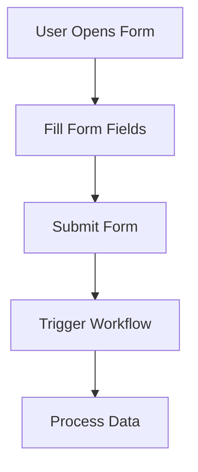

**Category:** Workflow Automation Platforms
**Difficulty:** Intermediate
**Reading time:** 6 min read

---

Zapier Interfaces is a form builder that allows you to create custom web forms and user interfaces without coding. These forms can trigger workflows, collect user input, and provide interactive experiences that integrate seamlessly with your connected applications.

- **Form Components** — Text inputs, dropdowns, checkboxes, file uploads, and other UI elements
- **Form Submission** — Converting user input into workflow triggers with data mapping
- **Custom Branding** — Ability to style forms with company colors and logos
- **Conditional Logic** — Show/hide fields based on user responses
- **Response Handling** — Sending confirmation emails or redirects after submission

Zapier Interfaces lets you design forms using a visual builder with drag-and-drop components. Each form field maps to data passed into your workflows. When users submit the form, Zapier captures the input, triggers the connected zap, and passes field values as variables. Forms can enforce validation rules, require specific formats, and provide real-time feedback. The platform generates shareable links for form distribution, making it easy to collect data from customers or team members.

- Collecting customer feedback or survey responses
- Creating internal request forms for IT or HR processes
- Building appointment booking interfaces
- Capturing lead information for sales teams
- Enabling user-driven workflow triggers

| Advantage | Disadvantage |
|-----------|--------------|
| No coding required | Limited customization compared to full web apps |
| Quick form creation | Basic styling options |
| Integrated submission handling | File upload limitations |

- [Zapier Tables database](zapier-tables-database.md)
- [Zapier AI chatbots](zapier-ai-chatbots.md)
- [Make.com visual automation](../workflow-automation-platforms/makecom-visual-automation.md)

---
*Part of the [Workflow Automation Platforms](workflow-automation-platforms/index.md) category · [Back to Master Index](../../index.md)*
