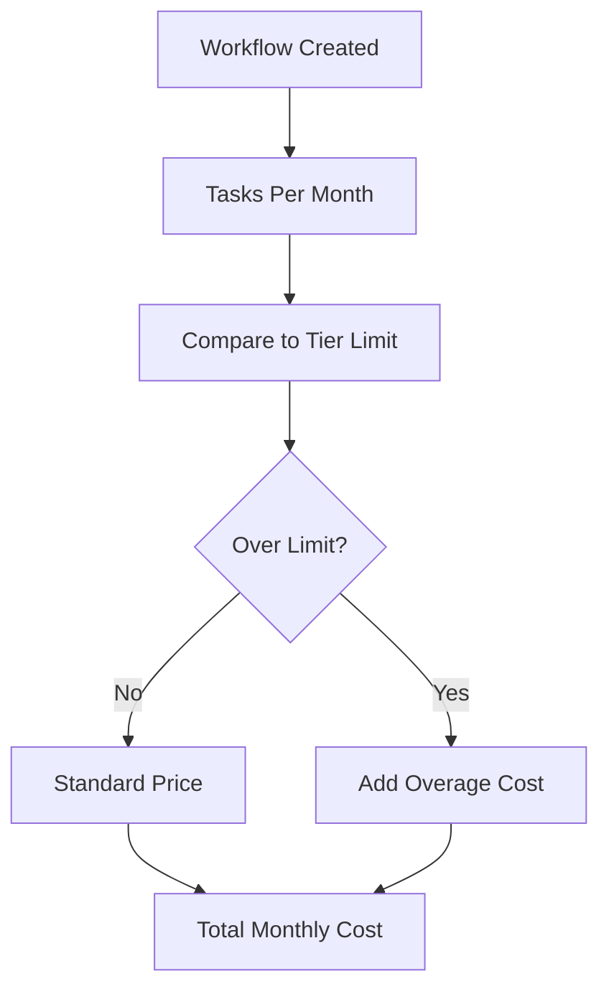

**Category:** Workflow Automation Platforms
**Difficulty:** Intermediate
**Reading time:** 6 min read

---

Understanding Zapier's pricing structure and task limits is crucial for budgeting automation costs and designing efficient workflows. Zapier offers multiple tiers with different feature sets and monthly task allowances to suit various business needs.

- **Task** — A single action within a workflow that processes one record
- **Pricing Tiers** — Free, Professional, Team, and Business plans with increasing costs
- **Monthly Task Allowances** — Number of tasks included in each pricing tier
- **Overage Fees** — Cost per additional task beyond the monthly allowance
- **Premium Features** — Advanced capabilities available only at higher tiers

Each Zapier plan includes a specific number of monthly tasks. When a workflow runs, it consumes tasks based on the number of records processed and actions taken. Higher-tier plans offer more tasks, additional apps, and premium features like advanced search filtering. If you exceed your monthly allocation, you pay per additional task at the end of the billing period. Usage tracking is available in real-time, helping you monitor costs and optimize workflows.

- Calculating automation ROI for business cases
- Budgeting for workflow expansion
- Choosing appropriate tier for team size
- Optimizing workflows to reduce task consumption
- Planning for growth and scaling costs

| Advantage | Disadvantage |
|-----------|--------------|
| Simple task-based pricing | Overage fees can be costly |
| Transparent cost structure | Tasks accumulate quickly with multiple zaps |
| Scalable from free to enterprise | Requires monitoring to avoid surprises |

- [Zapier app integrations (6000+)](zapier-app-integrations-6000.md)
- [Zapier custom apps and developer platform](zapier-custom-apps-and-developer-platform.md)
- [Make.com Apps marketplace](../workflow-automation-platforms/makecom-apps-marketplace.md)

---
*Part of the [Workflow Automation Platforms](workflow-automation-platforms/index.md) category · [Back to Master Index](../../index.md)*
