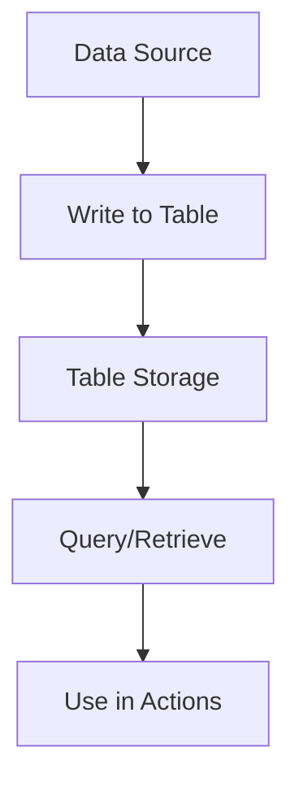

**Category:** Workflow Automation Platforms
**Difficulty:** Intermediate
**Reading time:** 6 min read

---

Zapier Tables is a built-in database solution that allows you to store, organize, and retrieve structured data within your Zapier workflows. It serves as a lightweight database alternative for managing information without requiring external database services.

- **Table Structure** — Rows and columns for organizing data with defined field types
- **Field Types** — Text, numbers, dates, checkboxes, and other data type options
- **Records** — Individual rows in a table containing data entries
- **Queries** — Searching and filtering table data based on criteria
- **API Integration** — Ability to read and write table data from workflows

Zapier Tables provides a simple columnar database structure integrated directly into the Zapier platform. You define table schemas with specific field types and constraints. Data flows into tables from various sources, and you can perform lookups, create new records, or update existing entries. The platform indexes table data for fast retrieval, supporting filtering and sorting operations. Tables can be accessed across multiple zaps, making them ideal for maintaining state or shared reference data across workflows.

- Maintaining customer contact lists and update frequencies
- Tracking inventory levels across multiple sales channels
- Storing configuration data used by multiple workflows
- Building audit trails for compliance and reporting
- Creating lookup tables for order fulfillment processes

| Advantage | Disadvantage |
|-----------|--------------|
| Integrated with Zapier | Limited query capabilities |
| No external database needed | Scalability limited for large datasets |
| Simple setup and management | No advanced relational features |

- [Zapier Interfaces form builder](zapier-interfaces-form-builder.md)
- [Zapier custom apps and developer platform](zapier-custom-apps-and-developer-platform.md)
- [n8n database integration](../workflow-automation-platforms/n8n-database-integration.md)

---
*Part of the [Workflow Automation Platforms](workflow-automation-platforms/index.md) category · [Back to Master Index](../../index.md)*
